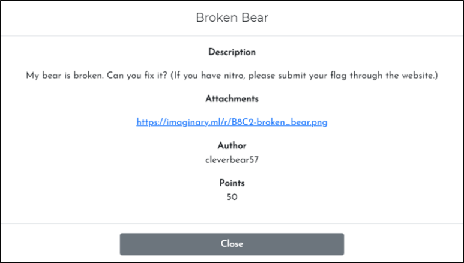
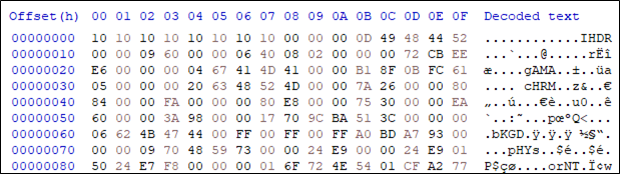
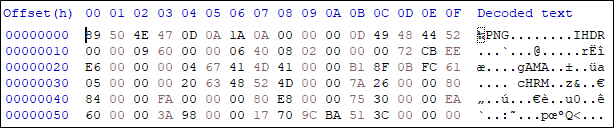
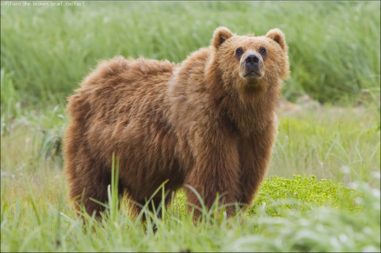

# [목차]
**1. [Description](#Description)**

**2. [Write-Up](#Write-Up)**

**3. [FLAG](#FLAG)**

***

# **Description**

첨부파일

[broken_bear.png](https://github.com/2jinu/CTFnWargame/raw/main/CTF/ImaginaryCTF%20Round10/Broken%20Bear/file/broken_bear.png)

# **Write-Up**

해당 이미지를 열어보면 헤더가 변조되어 있는 것을 확인할 수 있다.

0x00 ~ 0x07에 89 50 4E 47 0D 0A 1A 0A를 넣는다.

저장 후 파일을 열어보면 좌측 상단에서 flag를 획득할 수 있다.

# **FLAG**

**ictf{fixed_the_broken_bear!_:rooYay:}**