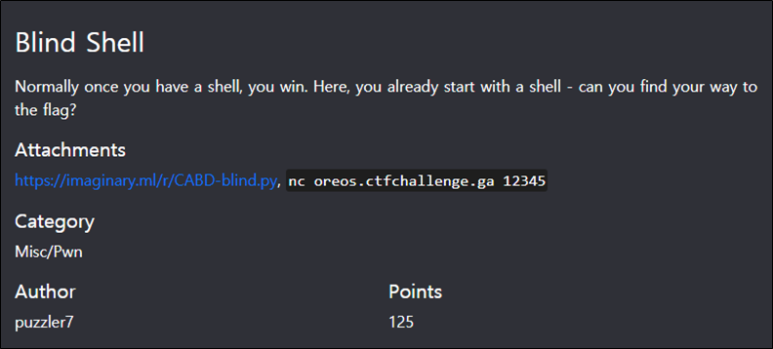

# [목차]
**1. [Description](#Description)**

**2. [Write-Up](#Write-Up)**

**3. [FLAG](#FLAG)**

***

# **Description**

첨부파일

# **Write-Up**

> [CODE BLOCK](https://rdmd.readme.io/docs/code-blocks)

# **FLAG**

**FLAG{...}**