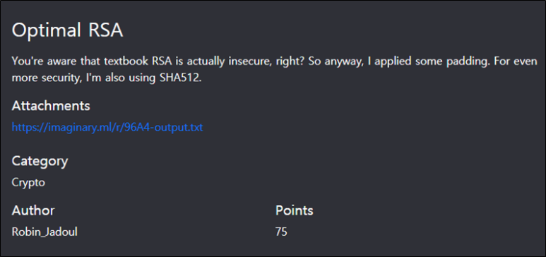
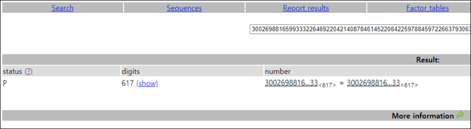
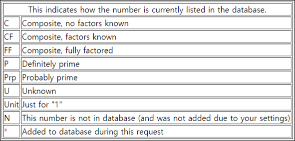

# [목차]
**1. [Description](#Description)**

**2. [Write-Up](#Write-Up)**

**3. [FLAG](#FLAG)**


***


# **Description**



첨부파일

[CODE BLOCK](https://rdmd.readme.io/docs/code-blocks)

# **Write-Up**

[factordb](http://factordb.com)에서 n을 검색하면 소수로 나온다.




다음과 같은 python코드로 복호화할 수 있다.

```py
# Windows : Cryptodome, Linux : Crypto
from Cryptodome.Cipher import PKCS1_OAEP
from Cryptodome.PublicKey import RSA
from Cryptodome.Hash import SHA512
import binascii
n=30026988165993332264692204214087846145220842259788459722663793063709989854266401133905288475446633657699992163531251077285227764172076446035823110108966750231078552155776791936090792504232810727562350418446766538847362755164930290809171852367701949039988140887714829232816471710268314188072030870245217078615254674268267664464852145758996406346159287129494958773788146776780988972666107148005992434289916413526240661685861273144661288139977987413076536762591805844788871244445903245434143916925660921016534152770322721172650385197306939399942459668658262531739159594719264834113764254996827458736667266202573242166233
phi = n-1 # n is prime
e=65537
d = pow(e, -1, phi) # python 3.9
c=binascii.unhexlify('5a61e39e2ec5cb8e9744e8cd3a9ff7dd625c26c546e86d12acd56b6180a50913629f3577e35d3f48ea4f9aa725f897f8cf01d5559c8d72c3aba731ad51ea1ed43e709281efba3bb3b5abddb68c1c7e891d246e902b203f41dac279d81b3cfd80302c4b6fdff0c37a4ba03146d4670cec2653d68fe0d8cd495f8049de359ed1058a862cf781b7beacb98eff6ecf9fe3ad4a318508a0475967a3d5d1e074114ea77c19eac4a974dfb8afd126f12bfda09649952a44e22009e58001a8080118a6476904db39c4ba29a58e2dcea24f1740d8eb0745dc6f64d0c117ffece9a88a9d02bb7bdb242ff67b2ae7293e7d069c721610d80f3e418062bdd3d93f738bff8ce9')

class Key:
    def __init__(self, n, e, d):
        self.n = n
        self.e = e
        self.d = d
    def _decrypt(self, ciphertext):
        result = pow(ciphertext, self.d, self.n)
        return result

key = Key(n, e, d)
print(PKCS1_OAEP.new(key, SHA512).decrypt(c).decode())
```


# **FLAG**

**ictf{single_primes_are_definitely_optimal}**