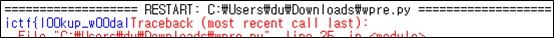
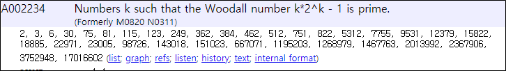

# [목차]
**1. [Description](#Description)**

**2. [Write-Up](#Write-Up)**

**3. [FLAG](#FLAG)**


***


# **Description**


첨부파일

[E0FA-wpre.py](https://github.com/2jinu/CTFnWargame/blob/main/CTF/ImaginaryCTF%20Round9/lookup-rev/file/E0FA-wpre.py)

# **Write-Up**

해당 스크립트를 실행 시키면 ictf까지 나오고 시간이 꾀나 걸린다.

```
i
c
t
f
```

이는 is_prime함수에서 시간이 걸리는 것으로, Windows기준 Cryptodome를 이용하여 효과적인 is_prime함수를 사용한다.

```py
import Cryptodome.Util.number
...
def is_prime(n):
    """
    Check if a given number is prime
    """
    #return all(n % i for i in islice(count(2), int(sqrt(n)-1)))
    return Cryptodome.Util.number.isPrime(n) == 1
...
        print(chr(key[0]^i%100), end='') # 출력 시 이쁘지 않으니 end='' 추가
...
```

수정 후 실행 시키면 ictf{l00kup_w00부터 꾀나 시간이 잡아 먹는다. 이는 while문에서 i += 1 때문이다. 일단 힌트를 얻기 위해 계속 기다려보면 ictf{l00kup_w00dal까지 볼 수 있다.



woodal number를 검색하면 Wikipedia를 찾아볼 수 있고, 여기서 https://oeis.org/A002234의 woodal number들을 확인할 수 있다.



다음과 같이 스크립트를 수정하면 flag를 획득할 수 있다.

```py
key = [0x6b, 0x60, 0x72, 0x78, 0x30, 0x3d, 0x3f, 0x27, 0x5a, 0x4b, 0x24, 0x61, 0x7b, 0x3, 0x26, 0x68, 0x56, 
       0x73, 0x23, 0x49, 0x25, 0x35, 0x34, 0x77, 0x77, 0x22, 0x18, 0x34, 0x77, 0x5a, 0x6b, 0x60, 0x4d]
i = 0
woodal_number = [2, 3, 6, 30, 75, 81, 115, 123, 249, 362, 384, 462, 512, 751, 822, 5312, 7755, 9531, 12379, 15822, 18885, 22971, 23005, 98726, 143018, 151023, 667071, 1195203, 1268979, 1467763, 2013992, 2367906, 3752948, 17016602]
while key != []:
    print(chr(key[0]^woodal_number[i]%100), end='')
    key.pop(0)
    i += 1
```

# **FLAG**

**ictf{l00kup_w00dall_pr1me5_78e7f}**