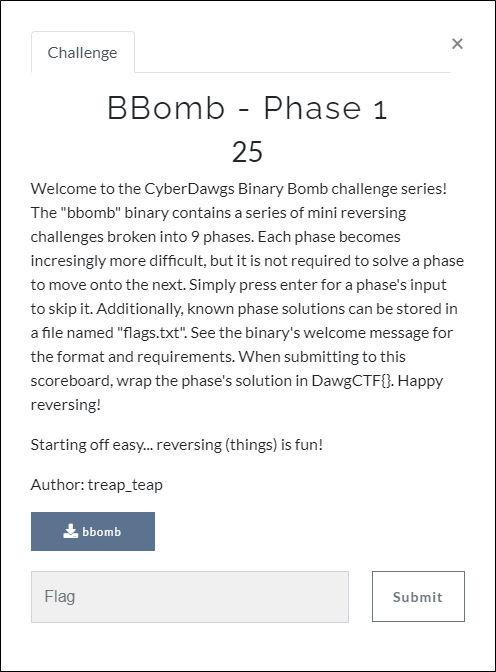
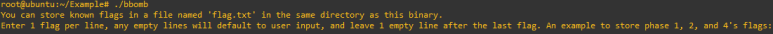
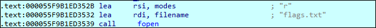
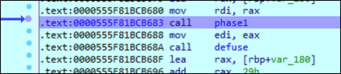
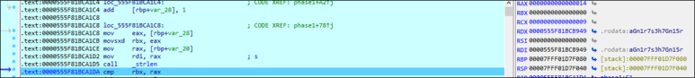
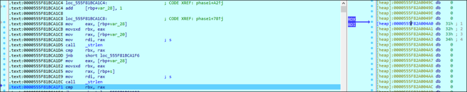
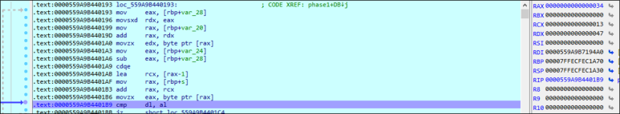

# [목차]
**1. [Description](#Description)**

**2. [Write-Up](#Write-Up)**

**3. [FLAG](#FLAG)**


***


# **Description**



첨부파일

[bbomb.zip](https://rdmd.readme.io/docs/code-blocks)


# **Write-Up**

해당 바이너리를 실행해보면 같은 디렉토리에 flag.txt를 미리 저장하여 불러올 수 있다고 한다.



하지만, 까보면 flags.txt를 불러온다. 따라서 flags.txt를 만들고 9줄로 아무 내용이나 입력해 놓는다.



0x555F81BCB683에 phase1함수가 있으니 따라들어간다.



0x555F81BCA1D5에서 "Gn1r7s_3h7_Gn15Rev3R"의 문자열의 길이(0x14=20)를 구한다.



0x555F81BCA1EC에서 flags.txt에 입력한 첫번째 줄의 문자열의 길이(0x04)를 구한다.(여기서 1234)



flags.txt에 입력한 첫번째 줄의 문자열의 길이를 20자로 맞추고 다시 run하다보면 0x559A9B4401B9에서 cmp를 하게되는데, "Gn1r7s_3h7_Gn15Rev3R"의 앞부분과 입력한 첫번째 줄의 문자열의 뒤부분과 비교한다. (여기서 1234*5)



다음과 같은 python 코드로 flag를 획득한다.

```py
# phase 1
original = 'Gn1r7s_3h7_Gn15Rev3R'
flag = original[::-1]
print("DawgCTF{"+flag+"}")
```


# **FLAG**

**DawgCTF{R3veR51nG_7h3_s7r1nG}**