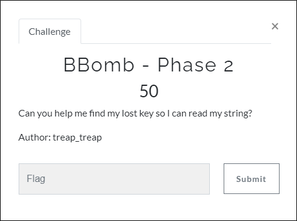
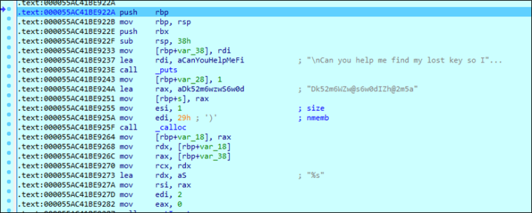
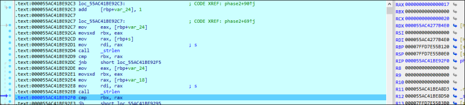
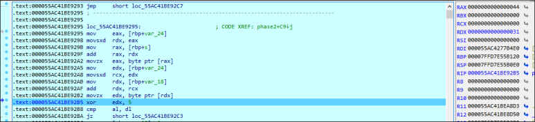

# [목차]
**1. [Description](#Description)**

**2. [Write-Up](#Write-Up)**

**3. [FLAG](#FLAG)**


***


# **Description**



첨부파일

[BBomb - Phase 1](https://github.com/2jinu/CTFnWargame/blob/main/CTF/%5B2021%5D%20DawgCTF/BBomb%20-%20Phase%201/Write-Up.md)의 파일을 사용


# **Write-Up**

[BBomb - Phase 1](https://github.com/2jinu/CTFnWargame/blob/main/CTF/%5B2021%5D%20DawgCTF/BBomb%20-%20Phase%201/Write-Up.md)과 같이 Phase2로 진입한다.



"Dk52m6WZw@s6w0dIZh@2m5a"의 문자열 길이(0x17=23)과 flags.txt의 두번째 줄의 문자열 길이(0x17=23)을 구한다. (여기서 두번째 줄은 "11111111111111111111111")



0x55AC41BE92B5에서 EDX(flags.txt의 두번째 줄의 첫번째 글자)와 0x05와 xor하여 EAX("Dk52m6WZw@s6w0dIZh@2m5a"의 첫번째 글자)와 비교한다.



다음과 같은 python 코드로 flag를 획득한다.

```py
# Phase 2
def byte_xor(ba1, ba2):
    return bytes([_a ^ _b for _a, _b in zip(ba1, ba2)])

binary_a = 'Dk52m6WZw@s6w0dIZh@2m5a'.encode()
binary_b = b'\x05'*len(binary_a)
key = byte_xor(binary_a, binary_b)
print("DawgCTF{"+key.decode()+"}")
```


# **FLAG**

**DawgCTF{An07h3R_rEv3r5aL_mE7h0d}**