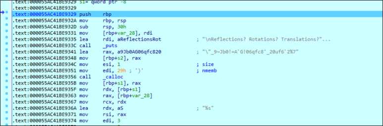

# [목차]
**1. [Description](#Description)**

**2. [Write-Up](#Write-Up)**

**3. [FLAG](#FLAG)**


***


# **Description**


첨부파일

[BBomb - Phase 1](https://github.com/2jinu/CTFnWargame/blob/main/CTF/%5B2021%5D%20DawgCTF/BBomb%20-%20Phase%201/Write-Up.md)의 파일을 사용


# **Write-Up**

[BBomb - Phase 1](https://github.com/2jinu/CTFnWargame/blob/main/CTF/%5B2021%5D%20DawgCTF/BBomb%20-%20Phase%201/Write-Up.md)과 같이 Phase3으로 진입한다.



0x55AC41BE9391에 func3_1과 func3_2에서 flags.txt의 세번째 줄의 문자열을 1글자씩 연산을 통해 바꾼다.

func3_1, func3_2 각각의 연산 로직은 파악하지는 못했다.


ASCII 코드에서 입출력이 가능한 문자를 모두 입력하였을 때, 규칙을 찾아내어 python 코드로 flag를 획득한다.

```py
# Phase 3
target = '"_9~Jb0!=A`G!06qfc8\'_20uf6`2%7'
print('DawgCTF{', end='')
for t in target:
    for i in range(33, 127):
        if 33 <= i <= 64:
            if t == chr(i+47): print(chr(i), end='')
        elif i == 65 or i == 66:
            if t == chr(i+60): print(chr(i), end='')         
        elif 67 <= i <= 77:
            if t == chr(i-34): print(chr(i), end='')
        elif 78 <= i <= 90:
            if t == chr(i+34): print(chr(i), end='')
        elif 91 <= i <= 96:
            if t == chr(i-47): print(chr(i), end='')
        elif 97 <= i <= 109:
            if t == chr(i-34): print(chr(i), end='')
        elif 110 <= i <= 122:
            if t == chr(i-60): print(chr(i), end='')
        elif 123 <= i <= 126:
            if t == chr(i-47): print(chr(i), end='')
print('}')
```


# **FLAG**

**DawgCTF{D0uBl3_Cyc1iC_rO74tI0n_S7r1nGs}**