# [목차]
**1. [Description](#Description)**

**2. [Write-Up](#Write-Up)**

**3. [FLAG](#FLAG)**

***

# **Description**

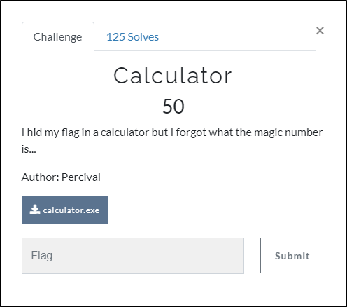

첨부파일

[calculator.zip](https://github.com/2jinu/CTFnWargame/raw/main/CTF/%5B2021%5D%20DawgCTF/Calculator/file/calculator.zip)

* Windows Defender가 잡아냅니다. 허용해주세요.

# **Write-Up**

파일을 실행해 보면 계산을 위해 파일들을 입력하라는 문구가 나온다.

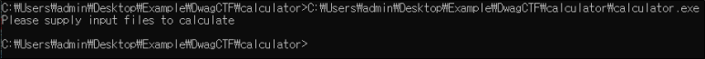

x64dbg기준 파일(F)->명령줄 바꾸기(L)을 통해서 인자값을 전달해본다.

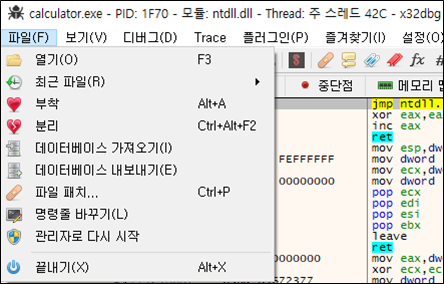
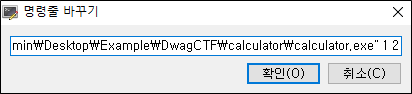

문자열에서 "Please supply ~"를 참조하는 주소(0xBB1B98)로 가서 인자를 주었을 때 분기되는 위치에 bp를 걸고 run을 한다.

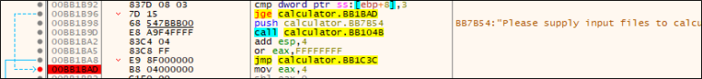

0xBB1BBC에서 0xBB1348을 호출하는데 타고 들어가면 0xBB17F0이 나온다.

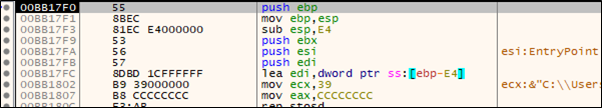

0xBB1823에서 [fopen](https://docs.microsoft.com/ko-kr/cpp/c-runtime-library/reference/fopen-wfopen?view=msvc-160)함수를 사용하는데 0x624509에 들어있는 0x31(1)과 0xBB7B4C에 들어있는 0x72(r)값들을 인자로 사용한다. 즉, calculator.exe와 같은 디렉토리에 1이라는 파일을 연다.

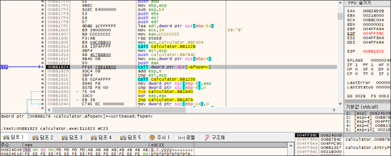

1이라는 파일을 생성하고 내용은 9로 넣어서 다시 fopen까지 run한 뒤, 0xBB1854의 함수를 호출하고 나면 EAX의 저장된 스택 주소에 파일 내용인 9가 저장되어 있다.

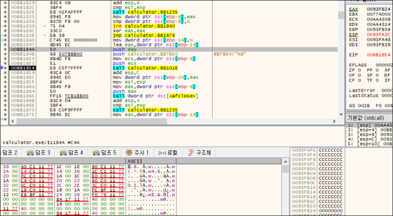

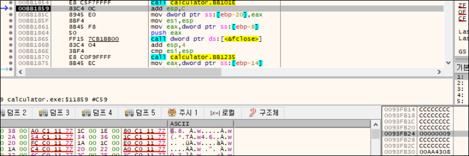

그다음 ret까지 가서 빠져나온 뒤 0xBB1BD5에서 다시 똑같은 함수를 부르지만 이번에는 인자로 들어가는 EDX가 두번째 인자인 2를 가르키고 있다. 즉, 1파일을 만들때와 마찬가지로 2라는 파일을 만들고 내용을 7로 넣어보고 실행해본다.

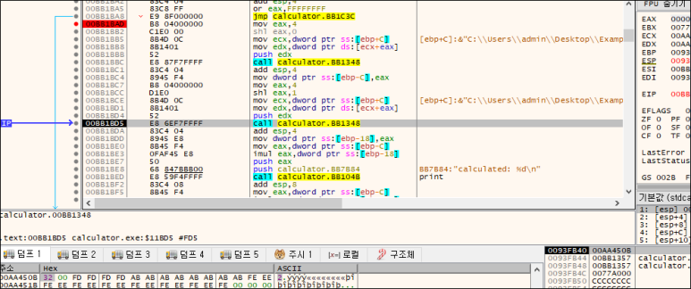

2개의 파일을 만들고 0xBB1BED를 실행하면 2개의 파일의 내용을 곱한 값(9*7)이 계산된다.

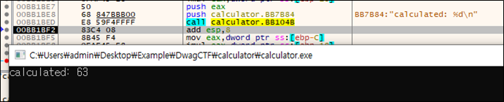

그리고 0xBB1BFC에서 곱한 값(9*7=63(0x3F))과 64(0x40)를 비교한다. 밑에 final flag라는 점을 가기위해서는 jne에 의해 점프되지 말아야 하므로, EAX값을 0x40으로 바꾸거나 cmp이후 ZF를 1로한다. ( 혹은 파일을 만들 때, 내용의 곱을 64로 맞춘다.)

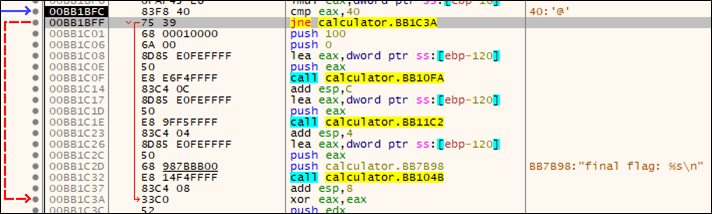

점프를 안했다면 0xBB1C32를 실행하면 flag가 출력된다.

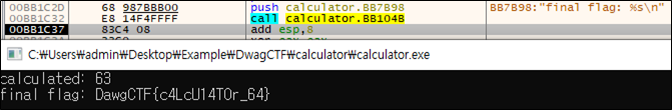

# **FLAG**

**DawgCTF{c4LcU14T0r_64}**