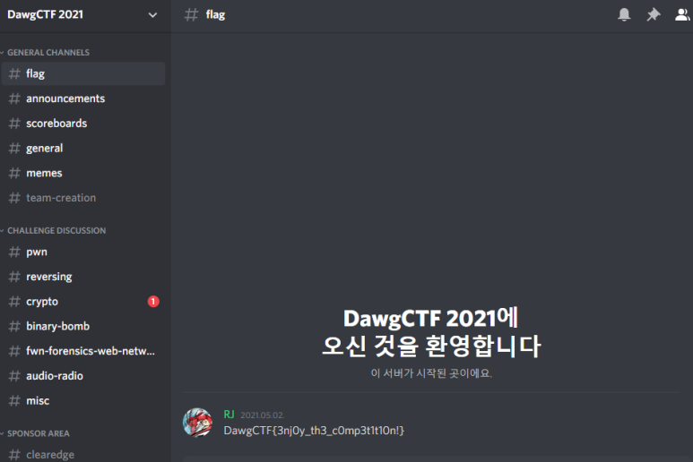

# [목차]
**1. [Description](#Description)**

**2. [Write-Up](#Write-Up)**

**3. [FLAG](#FLAG)**

***

# **Description**

# **Write-Up**

해당 discord 서버의 #flag로 들어가면 flag를 획득할 수 있다.

# **FLAG**

**DawgCTF{3nj0y_th3_c0mp3t1t10n!}**