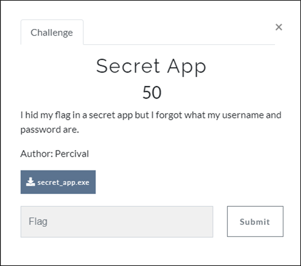
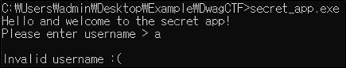
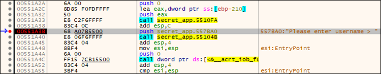
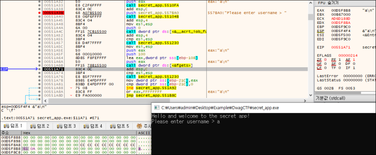
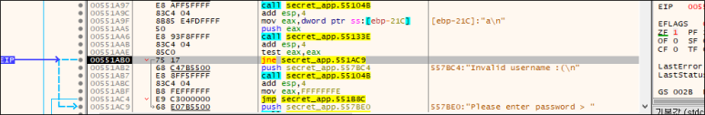
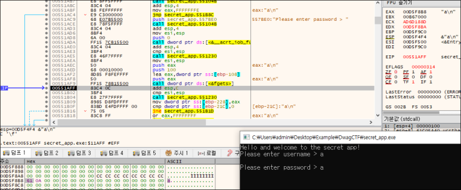
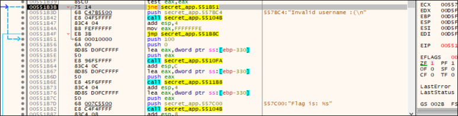
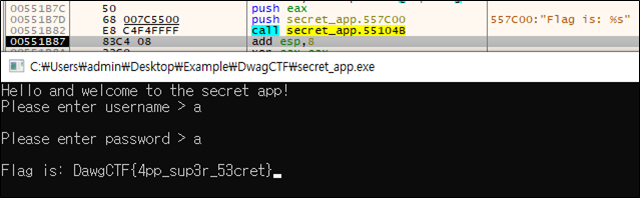

# [목차]
**1. [Description](#Description)**

**2. [Write-Up](#Write-Up)**

**3. [FLAG](#FLAG)**

***

# **Description**

첨부파일

[secret_app.zip](https://rdmd.readme.io/docs/code-blocks)

# **Write-Up**

실행해보면 username을 입력하라고 하고, 아무거나 입력해보면 역시나 틀렸다고 한다.

문자열 참조를 이용하여 "Please ~"를 참조하는 주소(0x551A3B)에 bp를 걸고 run한다.

fgets를 실행 후 username을 입력하면 EAX가 가르키는 주소(0xD5F8B8)에 입력한 값('a')가 저장된다.

0x551AB0으로 가면 사용자이름이 달라서 ZF가 1일 것이다. ZF를 0으로 변경하여 password입력 받는 주소로 이동한다.

fgets를 실행 후 password을 입력하여 username처럼 진행한다.

0x551B3B도 username을 우회한것처럼 ZF를 변경하여 flag를 출력하는 문으로 점프한다.

0x551B82를 실행하면 flag를 획득할 수 있다.

# **FLAG**

**DawgCTF{4pp_sup3r_53cret}**