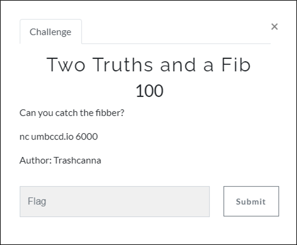
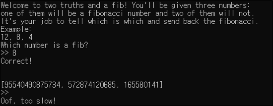

# [목차]
**1. [Description](#Description)**

**2. [Write-Up](#Write-Up)**

**3. [FLAG](#FLAG)**


***


# **Description**




# **Write-Up**

nc umbccd.io 6000으로 접속하면 3개의 숫자를 주고 피보나치 수인 숫자를 골라내는 문제가 나온다.



다음과 같은 python코드로 풀어본다.

```py
from pwn import *
import math

def isPerfectSquare(x):
    s = int(math.sqrt(x))
    return s*s == x

def isFibonacci(n): return isPerfectSquare(5*n*n + 4) or isPerfectSquare(5*n*n - 4)

r = remote("umbccd.io", 6000)
r.recvuntil('Correct!')
i = 1
print('{} Round'.format(i))
number_list_str = r.recvuntil('>>')
number_list = number_list_str.decode().strip().split(' ')
for index, n in enumerate(number_list):
    if index != 3:
        if index == 0: n = n[n.index("[")+1:n.index(",")]
        elif index == 1: n = n[:n.index(",")]
        else: n = n[:n.index("]")]

        if (isFibonacci(int(n)) == True):
            r.sendline(n)
            print(r.recv())
            print(r.recv())
            print(r.recv())

[Output]
[x] Opening connection to umbccd.io on port 6000
[x] Opening connection to umbccd.io on port 6000: Trying 167.172.155.117
[+] Opening connection to umbccd.io on port 6000: Done
1 Round
b' '
b'Correct!\n\n'
b'[121393, 68968457472554, 48837927792551]\n>> '
[*] Closed connection to umbccd.io port 6000
```

recv()한 데이터를 출력해보면 다시 문제를 출력해준다. 따라서 반복하여 풀어보면 100번을 반복하여 풀었을 때, flag를 획득할 수 있다.

```py
from pwn import *
import math, sys

def isPerfectSquare(x):
    s = int(math.sqrt(x))
    return s*s == x

def isFibonacci(n): return isPerfectSquare(5*n*n + 4) or isPerfectSquare(5*n*n - 4)

r = remote("umbccd.io", 6000)
r.recvuntil('Correct!')
i = 1
print('{} Round'.format(i))
number_list_str = r.recvuntil('>>')
number_list = number_list_str.decode().strip().split(' ')
for index, n in enumerate(number_list):
    if index != 3:
        if index == 0: n = n[n.index("[")+1:n.index(",")]
        elif index == 1: n = n[:n.index(",")]
        else: n = n[:n.index("]")]
        if (isFibonacci(int(n)) == True):
            r.sendline(n)
            r.recvuntil('Correct!')

while True:
    i+= 1
    print('{} Round'.format(i))
    while True:
        data = r.recv()
        if "DawgCTF{" in data.decode():
            print(data.decode())
            sys.exit(0)
        if "[" in data.decode(): break
    number_list_str = data
    number_list = number_list_str.decode().strip().split(' ')
    for index, n in enumerate(number_list):
        if index != 3:
            if index == 0: n = n[n.index("[")+1:n.index(",")]
            elif index == 1: n = n[:n.index(",")]
            else: n = n[:n.index("]")]
            if (isFibonacci(int(n)) == True): r.sendline(n)

[Output]
...
101 Round
Correct!

Congrats! Here's your flag: DawgCTF{jU$T_l1k3_w3lc0me_w33k}

[*] Closed connection to umbccd.io port 6000
```


# **FLAG**

**DawgCTF{jU$T_l1k3_w3lc0me_w33k}**