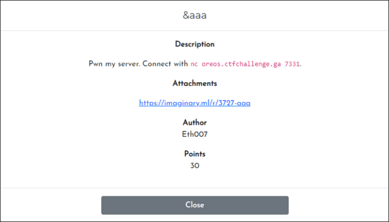
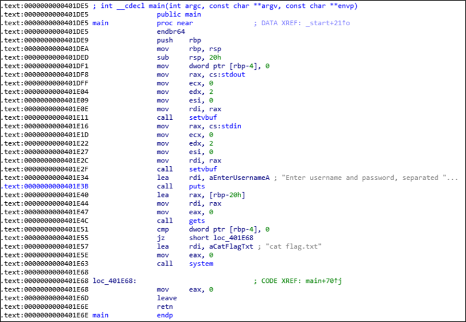
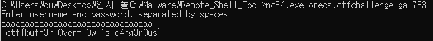

# [목차]
**1. [Description](#Description)**

**2. [Write-Up](#Write-Up)**

**3. [FLAG](#FLAG)**

***

# **Description**

첨부파일

[aaa.zip](https://rdmd.readme.io/docs/code-blocks)

# **Write-Up**

0x401DF1에 [rbp-4]에 dword만큼 0으로 채우고, [rbp-20]에서부터 변수 공간을 확보한다음, gets함수를 통해 입력받는다. 이때 입력값 길이에 대해 검사하지 않으므로 rbp-4에 데이터를 써서(overflow) [rbp-4]와 0을 비교하는 구문에서 jump를 하지않고 cat flag.txt구문으로 갈 수 있다.

32byte만큼 입력하면 flag를 획득 할 수 있다.

# **FLAG**

**ictf{buff3r_0verfl0w_1s_d4ng3r0us}**