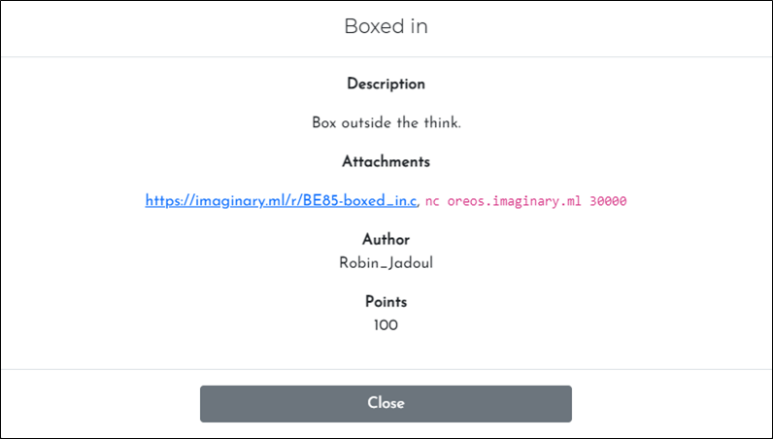
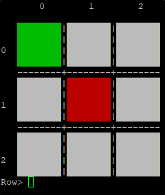
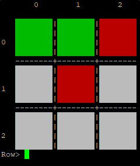
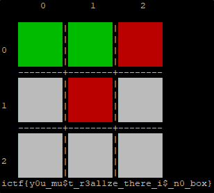

# [목차]
**1. [Description](#Description)**

**2. [Write-Up](#Write-Up)**

**3. [FLAG](#FLAG)**


***


# **Description**



첨부파일

[boxed_in.c](https://rdmd.readme.io/docs/code-blocks)


# **Write-Up**

readint함수의 int res = atoi(line)에서 integer overflow가 터진다.

int의 최대값은 2147483647으로 2147483647에서 1증가할 때마다 -2147483648에서부터 +1된다.

```c++
int readint() {
    ...
        int res = atoi(line);
    ...
}
```

flag를 획득하려면 player_move함수에서 true를 반환해야한다.

```c++
int main() {
    ...
        if (player_move()) {
            print();
            flag();
            return 0;
        }
    ...
}
```

player_move함수에서 true반환하려면 is_winning_line함수에서 4번의 is_함수의 결과 값들의 합이 2이상이여야 한다.

```c++
int is_winning_line(int x, int y, int dx, int dy, int player) {
    return (is_(x + dx, y+dy, player) + is_(x + 2*dx, y + 2*dy, player) + is_(x - dx, y - dy, player) + is_(x - 2*dx, y - 2*dy, player)) >= 2;
}
```

하지만 is_함수에서 조건에 맞지 않으면 0을 리턴하기 때문에 is_에 들어가는 인자값들은 0~2여야 한다.

```c++
int is_(int x, int y, int player) {
    if (x < 0 || x >= 3 || y < 0 || y >= 3) return 0;
    return field.grid[x][y] == player;
}
```

먼저 Col=-1, Row=0일때, 4번의 is_함수는

field.grid[0][0]과 field.grid[1][0]의 값이 2(PLAYER)이면

혹은

field.grid[0][1]과 field.grid[1][2]의 값이 2(PLAYER)이면

true를 리턴하여 4번의 is_의 합은 2가 되어 is_winning_line의 조건에 만족하여 true리턴하게 되고, player_move의 반환값이 true가 되어 flag를 획득할 수 있다.

field.grid[0][0]과 field.grid[1][0]의 값이 2인 경우를 따라하자면, 먼저 Row=0, Col=0을 입력해본다.



그다음 Row=0, Col=1을 입력해본다.



그 다음 Row=0, Col=4294967295(=-1)을 입력하면 flag를 획득할 수 있다.




# **FLAG**

**ictf{y0u_mu$t_r3al1ze_there_i$_n0_box}**