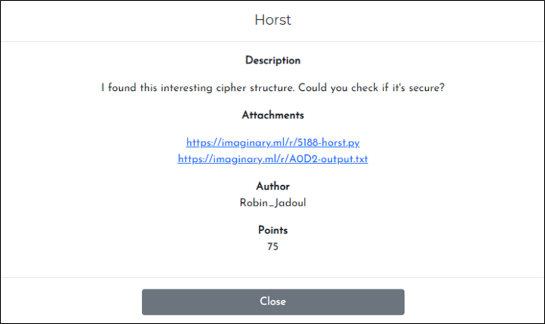

# [목차]
**1. [Description](#Description)**

**2. [Write-Up](#Write-Up)**

**3. [FLAG](#FLAG)**


***


# **Description**



첨부파일

[horst.py](https://github.com/2jinu/CTFnWargame/blob/main/CTF/%5B2021%5D%20ImaginaryCTF%20Round10/Horst/file/horst.py)
[out.txt](https://github.com/2jinu/CTFnWargame/blob/main/CTF/%5B2021%5D%20ImaginaryCTF%20Round10/Horst/file/out.txt)


# **Write-Up**

R은 마지막 출력에 그대로 정보가 담긴다는 점(return R+xor(L, F(R))과 xor은 output에 같은 key를 넣으면 원본 input값이 나온다는 점(y = xor(x, b) => x = xor(y, b))을 이용하여 복호화 python 코드를 작성하면 flag를 획득할 수 있다.

```py
import hashlib

ROUNDS = 25
BLOCKSIZE = 32

def xor(a, b):
    assert len(a) == len(b)
    return bytes(x ^ y for x, y in zip(a, b))

def F(x):
    return hashlib.sha256(x).digest()

def round(x):
    assert len(x) == 2 * BLOCKSIZE
    R = x[:BLOCKSIZE]
    invert_L = x[BLOCKSIZE:]
    L = xor(invert_L, F(R))
    return L+R

def decrypt(x):
    for _ in range(ROUNDS):
        x = round(x)
    return x

final_output = 'b020563166cfacda8201e8817265baf945b2dc49517f73903241f9fbedd3943d79d17b6ecd6acb45810eb95b1687ead8851fc923fdb40d5e208f3d4a34840bd1'
x = bytes.fromhex(final_output)
decrypted_result = decrypt(x)
print(decrypted_result.decode())
```


# **FLAG**

**ictf{imagine_not_using_a_key_for_your_feistel_cipher_67e63cc381}**