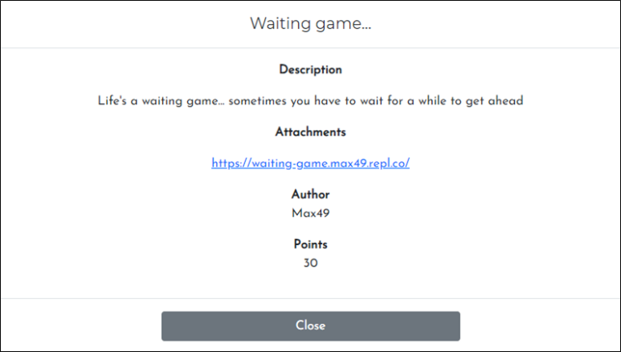
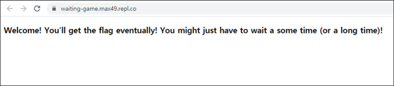
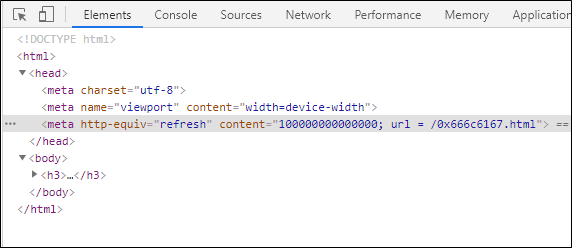
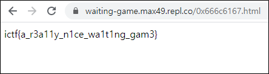

# [목차]
**1. [Description](#Description)**

**2. [Write-Up](#Write-Up)**

**3. [FLAG](#FLAG)**

***

# **Description**

첨부파일

[waiting-game.max49.repl.co](https://waiting-game.max49.repl.co)

# **Write-Up**

해당 주소로 웹브라우저를 통해 접속하면 다음과 같이 나온다.

chrome기준 F12를 눌러서 개발자도구를 이용하여 소스를 확인하면 100000000000000초 후에 [0x666c6167.html](https://waiting-game.max49.repl.co/0x666c6167.html)로 접속된다.

content의 숫자를 0으로 바꾸거나 url로 바로 접근하여 flag를 획득한다.

# **FLAG**

**ictf{a_r3a11y_n1ce_wa1t1ng_gam3}**