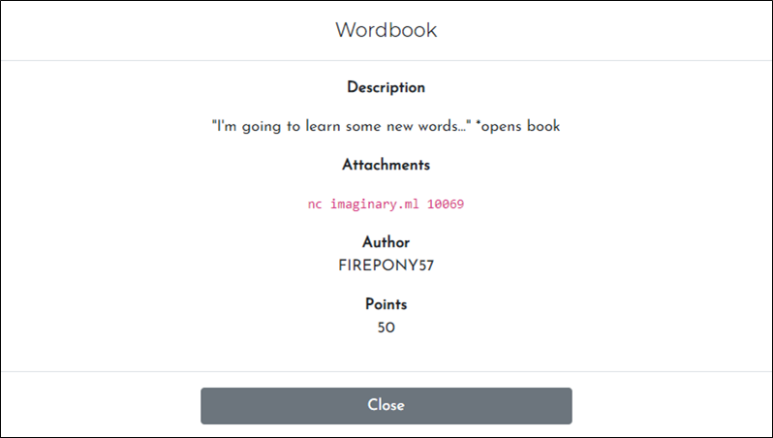
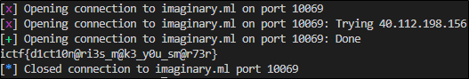

# [목차]
**1. [Description](#Description)**

**2. [Write-Up](#Write-Up)**

**3. [FLAG](#FLAG)**


***


# **Description**




# **Write-Up**

다음과 접속할 때마다 암호화된 데이터가 다르다는 것을 알 수 있다. 따라서 한번의 접속으로 암호화된 데이터를 보고 복호화를 할 수 있어야 한다.

```py
from pwn import *
p = remote("imaginary.ml", 10069)
p.recvuntil('\n')
encrypted_flag = p.recvuntil('\n')[:-1]

p.recvuntil('What would you like to encrypt?')
p.sendline('1')
p.recvuntil('Here ya go!\n')
encrypted_data = p.recvuntil('\n')[:-1]
print(encrypted_data)

[Output - 1]
[x] Opening connection to imaginary.ml on port 10069
[x] Opening connection to imaginary.ml on port 10069: Trying 40.112.198.156
[+] Opening connection to imaginary.ml on port 10069: Done
b'\xc3\xba'
[*] Closed connection to imaginary.ml port 10069
[Output - 2]
[x] Opening connection to imaginary.ml on port 10069
[x] Opening connection to imaginary.ml on port 10069: Trying 40.112.198.156
[+] Opening connection to imaginary.ml on port 10069: Done
b'\xc3\xaa'
[*] Closed connection to imaginary.ml port 1006
```

다음과 같은 python 코드로 flag를 획득할 수 있다.

```py
from pwn import *

ascii_plain = '! " # $ % & \' ( ) * + , - . / 0 1 2 3 4 5 6 7 8 9 : ; < = > ? @ A B C D E F G H I J K L M N O P Q R S T U V W X Y Z [ \\ ] ^ _ ` a b c d e f g h i j k l m n o p q r s t u v w x y z { | } ~'
ascii_list = ascii_plain.split()

p = remote("imaginary.ml", 10069)
p.recvuntil('\n')
encrypted_flag = p.recvuntil('\n')[:-1]

p.recvuntil('What would you like to encrypt?')
p.sendline(ascii_plain)
p.recvuntil('Here ya go!\n')
encrypted_ascii = p.recvuntil('\n')[:-1]
encrypted_ascii_list = encrypted_ascii.replace(encrypted_ascii[2:4], b' ').split()

for i in range(0, len(encrypted_flag), 2):
    if encrypted_flag[i:i+2] in encrypted_ascii_list:
        ascii_index = encrypted_ascii_list.index(encrypted_flag[i:i+2])
        print(ascii_list[ascii_index], end='')
print('')
```




# **FLAG**

**ictf{d1ct10n@ri3s_m@k3_y0u_sm@r73r}**