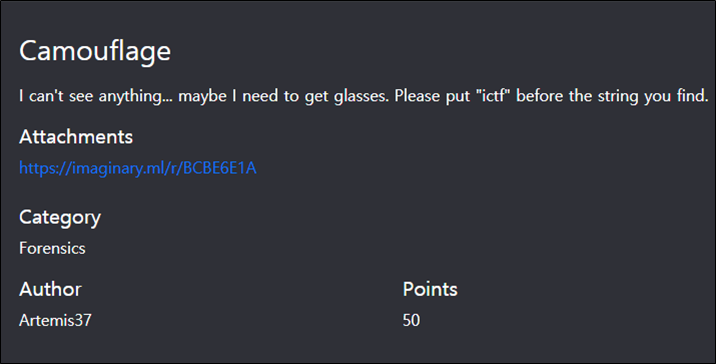
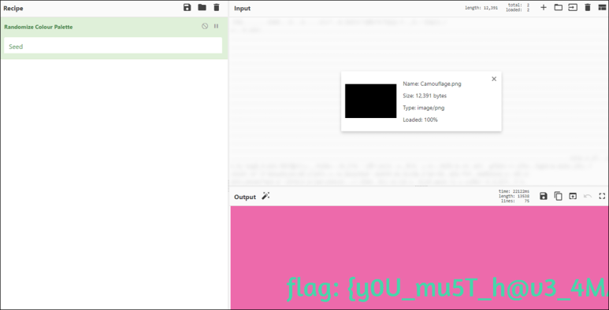
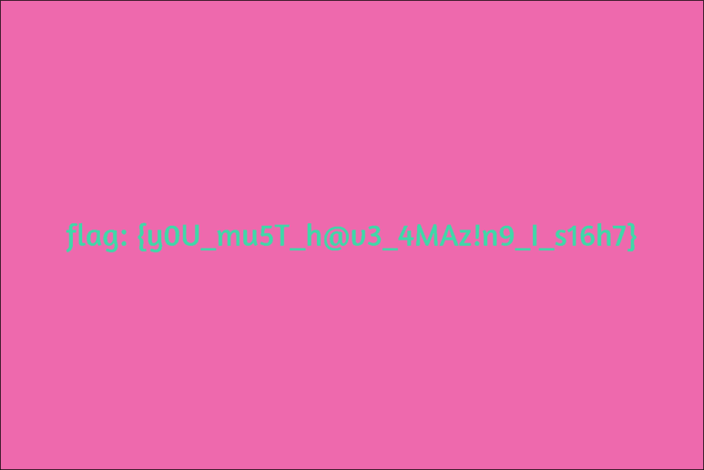

# [목차]
**1. [Description](#Description)**

**2. [Write-Up](#Write-Up)**

**3. [FLAG](#FLAG)**

***

# **Description**

첨부파일

[Camouflage.png](https://rdmd.readme.io/docs/code-blocks)

# **Write-Up**

CyberChef -> Forensics -> Randomize Colour Palette에서 파일을 끌어다 놓으면 flag를 획득할 수 있다.

# **FLAG**

**ictf{y0U_mu5T_h@v3_4MAz!n9_I_s16h7}**