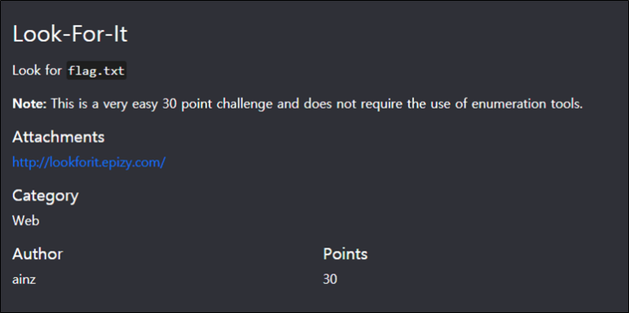
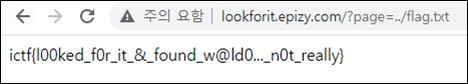

# [목차]
**1. [Description](#Description)**

**2. [Write-Up](#Write-Up)**

**3. [FLAG](#FLAG)**

***

# **Description**

첨부파일

http://lookforit.epizy.com

# **Write-Up**

해당 주소로 들어가보면 page라는 값에 데이터를 GET방식으로 넘기는 것 말고는 특별한 것이 없다.

하지만 directory traversal공격을 통해 flag를 획득할 수 있다.s

    http://lookforit.epizy.com/?page=../flag.txt

# **FLAG**

**FLAG{...}**