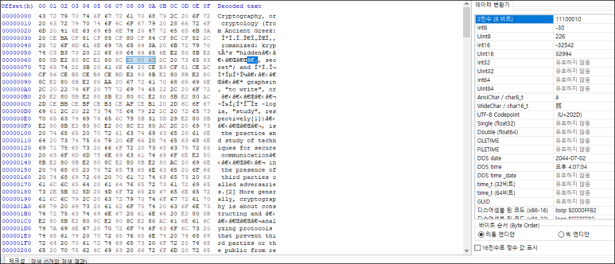

# [목차]
**1. [Description](#Description)**

**2. [Write-Up](#Write-Up)**

**3. [FLAG](#FLAG)**


***


# **Description**


첨부파일

[anew.rar](https://rdmd.readme.io/docs/code-blocks)


# **Write-Up**

먼저 압축을 해제 후 cryptography.txt파일을 확인하면 다음과 같이 많은 양의 텍스트가 있다.

```
Cryptography, or cryptology (from Ancient Greek: κρυπτός, romanized: kr...
```
​​‌​‍
키보드 방향키로 0 offset부터 오른쪽으로 이동하다보면, 중간 중간 멈추는 경우가 생긴다. hex editor로 열어보면 U+200B, U+200C, U+202C, U+202D등 바이트가 숨어있는 것을 확인할 수 있다.



[unicode steganography](https://330k.github.io/misc_tools/unicode_steganography.html)의 Text in Text Steganography Sampled에서 Steganography Text에 cryptography.txt내용을 모두 붙혀넣기 후, 하단의 모든 체크박스에 체크를 한 후 decode버튼을 누르면 숨겨진 문자열(thisisthepasswordforthefilebutinzwspglhf)이 나온다.


ubuntu에서 steghide를 통해 82116adcf6426051625ea6e27b9425e1.jpg로 부터 데이터를 추출해 본다. unicode steganography를 통해 얻은 문자열을 passphrase에 입력하면 quack.zlib라는 파일이 추출된다.

```sh
#  apt-get install -y steghide
root@ubuntu:~# steghide extract -sf 82116adcf6426051625ea6e27b9425e1.jpg
Enter passphrase:
wrote extracted data to "quack.zlib".
```

해당 zlib를 다음과 같은 python 코드로 decompress한다.

```py
import zlib

with open('quack.zlib', 'rb') as fp:
    data = fp.read()

raw_data = zlib.decompress(data)
with open('flag', 'wb') as fp:
    fp.write(raw_data)
```

python 코드를 실행하면 flag라는 파일이 생성되는데 해당 파일의 헤더를 확인하면 PNG임을 알 수 있다.


확장자를 png로 바꾸어 파일을 확인하면 flag를 획득할 수 있다.


# **FLAG**

**ICTF{s0m371m3s_zl1b_1s_1mp0r74n7_;(}**