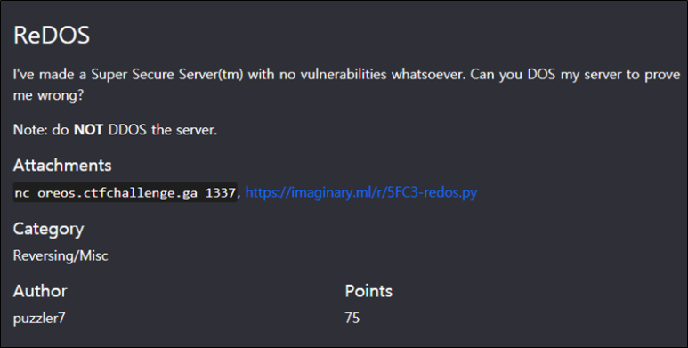
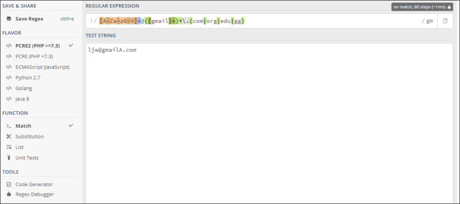
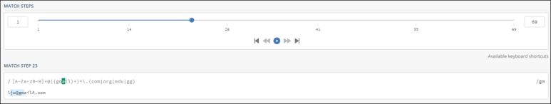

# [목차]
**1. [Description](#Description)**

**2. [Write-Up](#Write-Up)**

**3. [FLAG](#FLAG)**


***


# **Description**



첨부파일

[redos.py](https://rdmd.readme.io/docs/code-blocks)


# **Write-Up**

flag는 TimeoutError를 일으켜야 얻을 수 있는 것을 확인한다.

```py
...
	except TimeoutError as e:
		print("Catastrophic Error")
		print("Error code: "+open("flag.txt", "r").read())
...
```

TimeoutError는 validateEmail함수에서 일으킬 수 있는 것을 확인한다.

```py
@timeout_decorator.timeout(10, timeout_exception=TimeoutError)
def validateEmail(email):
	return emailRegex.match(email) is not None
```

emailRegex를 분석해보자.

[A-Za-z0-9]+ : 영문 대문자, 소문자, 숫자 중 1개 이상을 찾는다.

@ : @를 찾는다.

((gmail)+)* : gmail이라는 문자를  1회 이상 찾고 이를 0회 이상 찾는다.

\\. : .을 찾는다.

(com|org|edu|gg) : com 혹은 org 혹은 edu 혹은 gg를 찾는다.

```py
emailRegex = re.compile(r'[A-Za-z0-9]+@((gmail)+)*\.(com|org|edu|gg)')
```

((gmail)+)*에서 catastrophic backtracking이 일어나서 시간을 많이 잡아먹는다.

즉, ljw@gmailA.com이라는 문자열이 대상이라면,

1. (gmail)+까지 찾고 A는 g가 아니기때문에 *패턴으로 넘어간다.

2. 다시 A는 g가 아니기 때문에 (gmail)+패턴과 불일치 하여 .과 비교를 시작하는 단계로 넘어간다.

3. 패턴이 불일치하기 때문에 [A-Z~부터 다시 찾는다.

이해하기 편하려면 [regex101](https://regex101.com/)에서 다음과 같이 입력값을 넣고, 좌측 FLAVOR에서 PCRE를 선택 후 Regex Debugger를 통해 확인한다.





이제 @와 gmailA.com사이에 좀 더 많은 gmail을 넣으면 반복횟수가 증가하여 TimeoutError를 일으킬 수 있다.

```
Welcome to Super Secure Server(tm)!
1: Login
2: Create Account
3: Change Password

Enter your choice: 2

Email: ljw@gmailgmailgmailgmailgmailgmailgmailgmailgmailgmailgmailgmailgmailgmailgmailgmailgmailgmailgmailgmailgmailgmailgmailgmailgmailgmailgmailA.com
Catastrophic Error
Error code: ictf{3v3n_r3g3x_i5_in53cur3}


Server shutting down...
```


# **FLAG**

**ictf{3v3n_r3g3x_i5_in53cur3}**