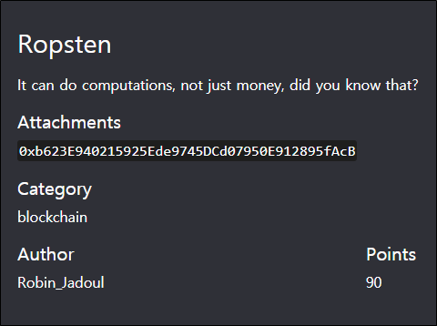
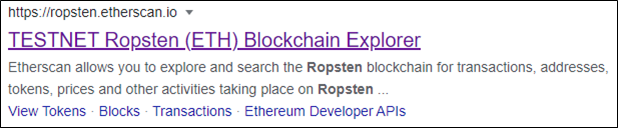
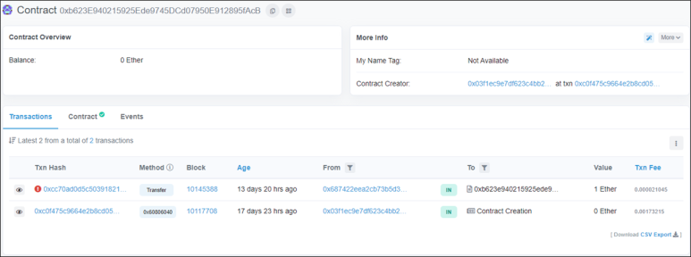
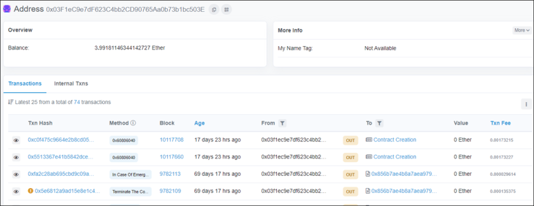
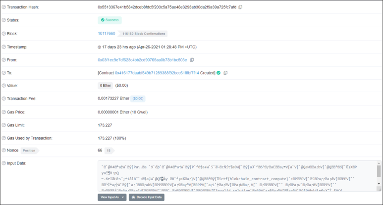

# [목차]
**1. [Description](#Description)**

**2. [Write-Up](#Write-Up)**

**3. [FLAG](#FLAG)**

***

# **Description**

첨부파일

    0xb623E940215925Ede9745DCd07950E912895fAcB

# **Write-Up**

"Ropsten"으로 검색하면 [Etherscan](https://ropsten.etherscan.io/) 주소를 발견할 수 있다.

첨부파일의 값으로 검색하면 다음과 같이 나온다.

Transaction에는 별다른 내용이 없었고, 0x03F1eC9e7dF623C4bb2CD90765Aa0b73b1bc503E로 따라 들어가본다.

Transaction 들 중 0x5513367e41b5842dceb8fdc5f203c5a75ae48e3293ab30da2f9a39a725fc7afd에 들어가서 Input Data를 UTF-8로 변환하면 flag를 획득할 수 있다.

# **FLAG**

**ictf{blokchain_contract_compute}**