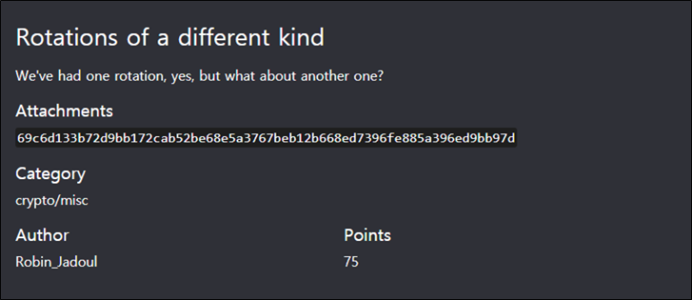

# [목차]
**1. [Description](#Description)**

**2. [Write-Up](#Write-Up)**

**3. [FLAG](#FLAG)**


***


# **Description**



첨부파일

    69c6d133b72d9bb172cab52be68e5a3767beb12b668ed7396fe885a396ed9bb97d


# **Write-Up**

[CyberChef](https://gchq.github.io/CyberChef/)에서 From Hex를 통해 디코딩해보면 다음과 같이 나온다.

    iÆÑ3·-.±rʵ+æ.Z7g¾±+f.×9oè.£.í.¹}

Rotate left에서 Amount를 7로 하면 다음과 같이 나온다.

    ´cè.Û.ÍØ9eÚ.sG-.³_Ø.3Gë.·tÂÑKöÍܾ

Amount를 14로 하면 다음과 같이 나온다.

    Z±tÌíKæl.²mʹ£.ÍÙ¯lÊ.£õNÛ:aè¥{æn_

즉, 첫번째 문자열은 0, 두번째 문자열은 7, 세번째 문자열은 14로 +7씩 Rotate left를 하면 flag를 획득할 수 있다.

```py
def rotateLeft(x, n):
	shiftBit = x << n
	shiftBit &= 255
	carryBit = x >> 8 - n
	result= shiftBit | carryBit
	return result

hex_string = '69c6d133b72d9bb172cab52be68e5a3767beb12b668ed7396fe885a396ed9bb97d'
cnt = 0
for i in range(0, len(hex_string), 2):
    hex_char = int(hex_string[i:i+2], 16)
    if cnt != 0:
        for x in range(cnt): hex_char = rotateLeft(hex_char, 7)
    else: hex_char = rotateLeft(hex_char, 0)
    print(chr(hex_char), end='')
    cnt += 1
```

# **FLAG**

**ictf{incrementing_left_rotations}**