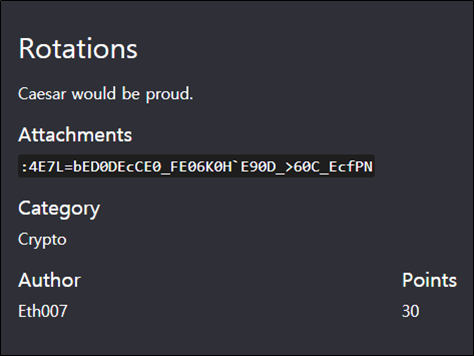
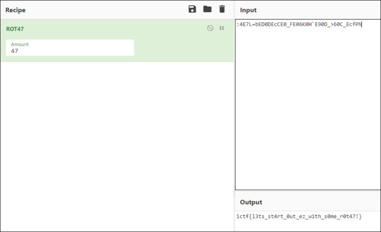

# [목차]
**1. [Description](#Description)**

**2. [Write-Up](#Write-Up)**

**3. [FLAG](#FLAG)**

***

# **Description**

첨부파일

    :4E7L=bED0DEcCE0_FE06K0H`E90D_>60C_EcfPN

# **Write-Up**

[CyberChef](https://gchq.github.io/CyberChef/)를 이용하여 ROT47에 Attachments값을 넣으면 flag를 획득할 수 있다.

# **FLAG**

**ictf{l3ts_st4rt_0ut_ez_w1th_s0me_r0t47!}**