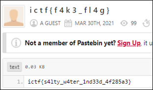

# [목차]
**1. [Description](#Description)**

**2. [Write-Up](#Write-Up)**

**3. [FLAG](#FLAG)**


***


# **Description**


첨부파일

[salty.py](https://rdmd.readme.io/docs/code-blocks)


# **Write-Up**

2개의 "".join(~)부분을 출력하면 Hash값과 url이 나온다.

```py
print("".join([chr(ord(n) ^ 69) for n in "p\'|$!$\'\'rttvp#\'utvw# q \'$#v#v\'#|qupr&t\'| ursvvu#vr&\'!!|q!p\'!q#uuw}&v v}!q\'s\'trrrv!!q|#& s$p$# r#$\'#&&\'#}p!sqpw |\'t#r} pqwv!p&$u&"]))
print("".join([chr(ord(n) ^ 69) for n in "-1156\x7fjj5$61 \',+k&*(j3\x10rs$\x0f3\x06"]))

[Output]
5b9adabb71135fb0132fe4ebaf3f3bf94057c1b9e076330f37cbdd94d5bd4f0028c3e38d4b6b17773dd49fce6a5afe7fabfccbf85d6452e9b1f78e5423d5ca0c
https://pastebin.com/vU76aJvC
```

[crackstation](https://crackstation.net/)에서 sha512 crack했을 때, saltwater라는 값이 나왔다.


하지만 password는 "salt"+inp이 아닌 inp이므로 password는 water이고 [url](https://pastebin.com/vU76aJvC)에 접속하여 water를 입력하면 flag를 획득할 수 있다.




# **FLAG**

**ictf{s4lty_w4ter_1nd33d_4f285a3}**