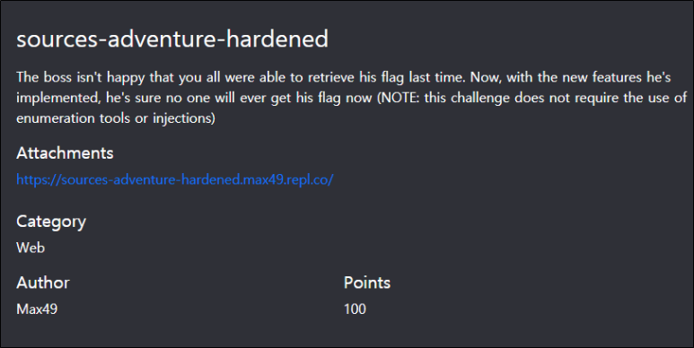
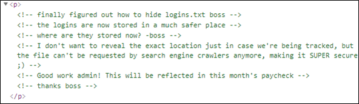
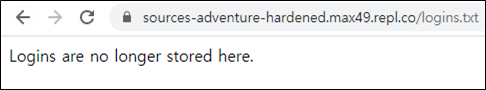
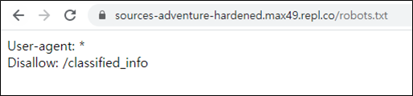
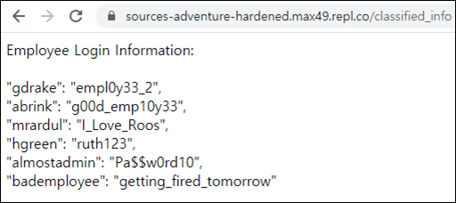
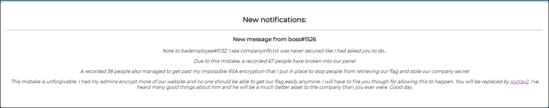
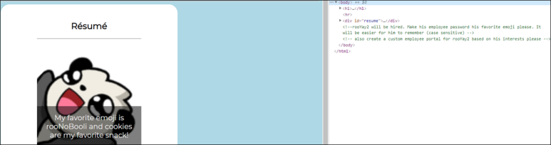
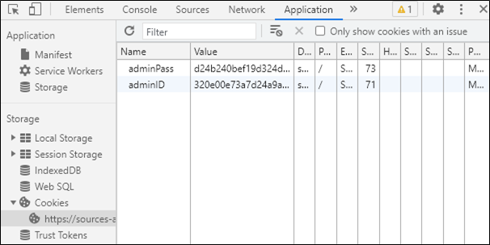
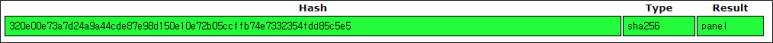
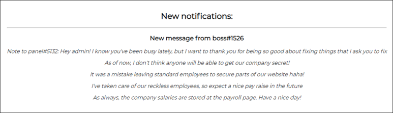

# [목차]
**1. [Description](#Description)**

**2. [Write-Up](#Write-Up)**

**3. [FLAG](#FLAG)**


***


# **Description**




# **Write-Up**

해당 주소로 웹브라우저를 통해 접속 후 개발자도구로 주석처리된 내용을 확인할 수 있다.



logins.txt를 숨겼다고 하는데 접속해보면 더 이상 여기에 저장이 안된다고 한다.



크롤러라는 단어를 힌트삼아 robots.txt에 접근하면 새로운 경로를 얻을 수 있다.



classified_info경로로 접근하면 직원들의 로그인 정보를 확인할 수 있다.



아무 계정을 선택해서 접속하면 rooYay2 프로필에 대한 링크가 주어진다.



rooYay2프로필에 접속 후 개발자도구로 주석을 확인해보면 rooYay2의 비밀번호는 가장 좋아하는 emoji이고 그림에 마우스포인터를 올려놓으면 emoji가 무엇(rooNoBooli)인지 나오고 cookie가 가장 좋아하는 과자라고 한다.



개발자도구를 통해 쿠키값을 확인하면 adminID와 adminPass가 Hash형태로 나온다.



Hash들을 크랙하면 adminID는 panel이고, adminPass는 "991560128"licypz라는 것을 알 수 있다.




얻은 계정을 통해 접속하면 payroll이라는 page에 대한 힌트를 얻을 수 있다.



/payroll로 접속하면 payrollinformationictf.json를 다운받게 되고 열어보면 다음과 같다.

```
[{"Employee Username": "gdrake","Salary": "$15","Employee Rating": 5,"ID Code": "t!_6c6f6c}"},{"Employee Username": "abrink","Salary": "$13","Employee Rating": 8,"ID Code": "3_gr3a"},{"Employee Username": "mrardul","Salary": "$5","Employee Rating": 3,"ID Code": "s_ar"},{"Employee Username": "hgreen","Salary": "$24","Employee Rating": 11,"ID Code": "00l"},{"Employee Username": "almostadmin","Salary": "$30","Employee Rating": 15,"ID Code": "3r_t"},{"Employee Username": "bademployee","Salary": "$0.10","Employee Rating": -1,"ID Code": "3l0p"},{"Employee Username": "rooYay2","Salary": "$11","Employee Rating": 10,"ID Code": "{d3v"},{"Employee Username": "panel","Salary": "$60","Employee Rating": 20,"ID Code": "ictf"}]
```

ImaginaryCTF는 flag형식이 ictf인데 ID Code에서 ictf라는 문자열을 확인할 수 있고, 뒤에서부터 ID Code를 조합하면 flag를 획득할 수 있다.


# **FLAG**

**ictf{d3v3l0p3r_t00ls_a3_gr3ar_6c6f6c}**