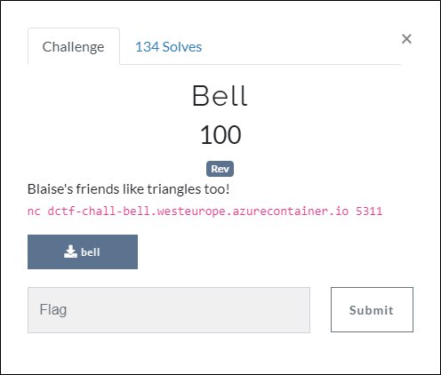
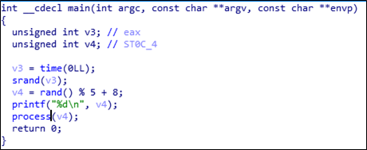
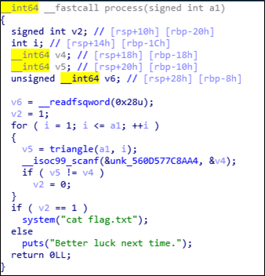
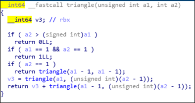

# [목차]
**1. [Description](#Description)**

**2. [Write-Up](#Write-Up)**

**3. [FLAG](#FLAG)**


***


# **Description**



첨부파일

[bell.zip](https://github.com/2jinu/CTFnWargame/raw/main/CTF/%5B2021%5D%20dCTF/Bell/file/bell.zip)

# **Write-Up**

IDA를 통해 main함수를 Pseudocode로 변환하면 다음과 같다.



다음으로 필요한 process함수를 Pseudocode로 변환하면 다음과 같다.



triangle함수를 Pseudocode로 변환하면 다음과 같다.



문제 서버에서 주는 값을 통해 입력값을 넣어내기 위한 코드를 정리하면 다음과 같다.

```c++
#include <stdio.h>
#include <stdlib.h>
#include <time.h>

int triangle(unsigned int a1, int a2){
	long long v3;
	if ( a2 > (signed int)a1 ) return 0;
	if ( a1 == 1 && a2 == 1 ) return 1;
	if ( a2 == 1) return triangle(a1 - 1, a1 - 1);
	v3 = triangle(a1, (unsigned int)(a2 - 1));
	return v3 + triangle(a1 - 1, (unsigned int)(a2 - 1));
}
int process(signed int a1){
	signed int v2 = 1;
	long long v4, v5;
	unsigned long long v6;
	for(int i = 1; i <= a1; ++i){
		v5 = triangle(a1, i);
		printf("%lld\n", v5);
	}
	return 0;
}
int main(void){
	unsigned int v4;
	scanf("%d", &v4);
	process(v4);
	return 0;
}
```

nc를 통해서 접속하면 랜덤한 값을 얻는다.

```sh
root@ubuntu:~# nc dctf-chall-bell.westeurope.azurecontainer.io 5311
11
```

작성한 코드를 컴파일 후 실행시켜서 11을 입력한다.

```sh
root@ubuntu:~/test# ./test
11
115975
137122
162409
192713
229114
272947
325869
389946
467767
562595
678570
```

출력된 값을 nc세션에 붙혀넣으면 flag를 획득할 수 있다.

```sh
root@ubuntu:~# nc dctf-chall-bell.westeurope.azurecontainer.io 5311
11
115975
137122
162409
192713
229114
272947
325869
389946
467767
562595
678570
dctf{f1rst_step_t0wards_b3ll_l4bs}
```

# **FLAG**

**dctf{f1rst_step_t0wards_b3ll_l4bs}**