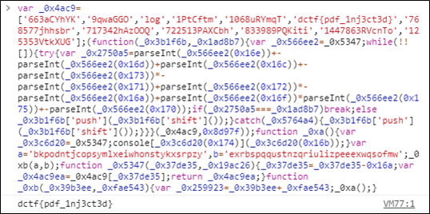

# [목차]
**1. [Description](#Description)**

**2. [Write-Up](#Write-Up)**

**3. [FLAG](#FLAG)**

***

# **Description**

첨부파일

[dragon.pdf](https://rdmd.readme.io/docs/code-blocks)

# **Write-Up**

[peepdf.py](https://rdmd.readme.io/docs/code-blocks)으로 dragon.pdf를 열어보면 javascript가 object 3에 존재한다는 것을 확인할 수 있다.

object 3을 입력하면 javascript code가 나타난다.

해당 code를 실행하면 flag를 획득할 수 있다.

# **FLAG**

**dctf{pdf_1nj3ct3d}**