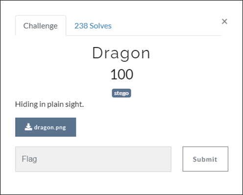
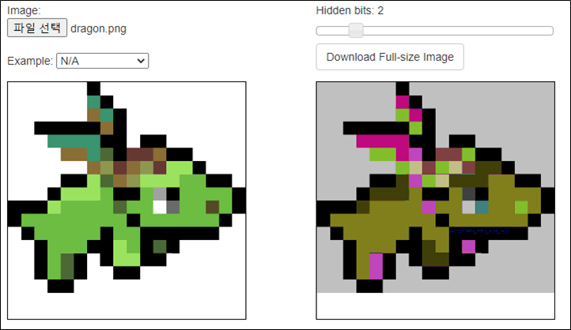
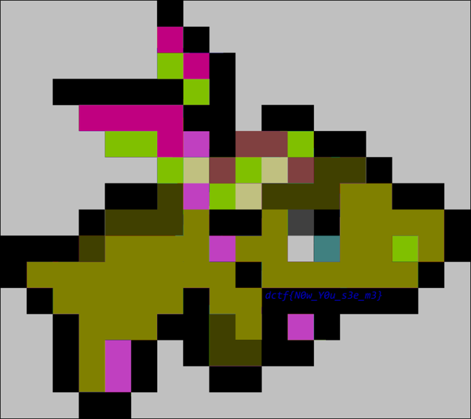

# [목차]
**1. [Description](#Description)**

**2. [Write-Up](#Write-Up)**

**3. [FLAG](#FLAG)**

***

# **Description**

첨부파일

[dragon.png](https://rdmd.readme.io/docs/code-blocks)

# **Write-Up**

[incoherency](https://incoherency.co.uk/image-steganography/#unhide)를 통해 이미지파일을 넣으면 글자가 보인다.

결과를 확대하면 flag를 획득할 수 있다.

# **FLAG**

**dctf(N0w_Y0u_S3e_m3}**