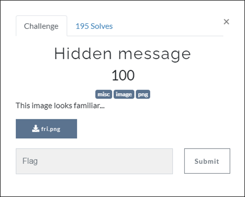
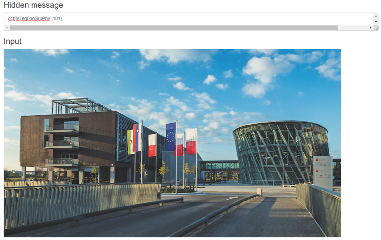

# [목차]
**1. [Description](#Description)**

**2. [Write-Up](#Write-Up)**

**3. [FLAG](#FLAG)**

***

# **Description**

첨부파일

[fri.png](https://github.com/2jinu/CTFnWargame/raw/main/CTF/%5B2021%5D%20dCTF/Hidden%20message/file/fri.png)

# **Write-Up**

[stylesuxx.github.io](https://stylesuxx.github.io/steganography/)을 통해 이미지를 decode하면 flag를 획득할 수 있다.

# **FLAG**

**dctf{sTeg0noGr4Phy_101}**