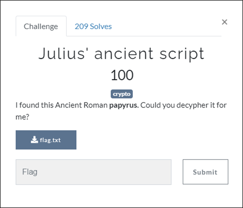
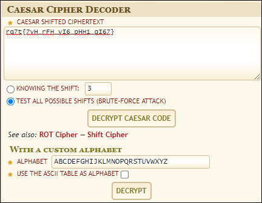
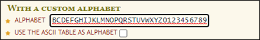
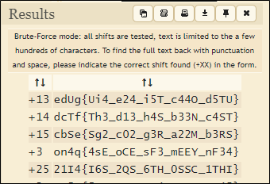

# [목차]
**1. [Description](#Description)**

**2. [Write-Up](#Write-Up)**

**3. [FLAG](#FLAG)**

***

# **Description**

첨부파일

[flag.txt](https://rdmd.readme.io/docs/code-blocks)

# **Write-Up**

julius ancient로 google검색 엔진에 입력하면 Julius Caesar라는 키워드를 얻을 수 있고, Crpyto분야이기 때문에 Ceasar Cipher문제임을 예상해본다.

[caesar-cipher](https://www.dcode.fr/caesar-cipher)에 접속하여 암호화된 값을 넣어본다.

숫자도 있기에 ALPHABET에 숫자도 추가해준다.

그리고 DECRYPT버튼을 누르면 flag를 획득할 수 있다.

# **FLAG**

**dcTf{Th3_d13_h4S_b33N_c4ST}**