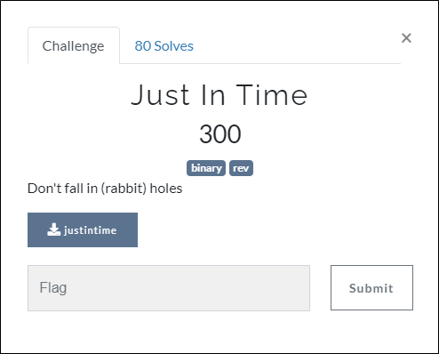
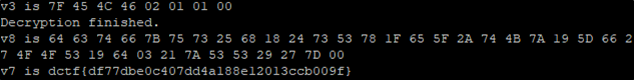

# [목차]
**1. [Description](#Description)**

**2. [Write-Up](#Write-Up)**

**3. [FLAG](#FLAG)**


***


# **Description**



첨부파일

[justintime.zip](https://github.com/2jinu/CTFnWargame/raw/main/CTF/%5B2021%5D%20dCTF/Just%20In%20Time/file/justintime.zip)


# **Write-Up**

바이너리 파일을 IDA를 통해 Pseudocode로 변환하면 다음과 같다.

```c++
#include <stdio.h>
#include <stdlib.h>
#include <string.h>
#include <stdint.h>

unsigned char *sub_126A(const char *a1){
	unsigned char *ptr;
	FILE *stream;
	ptr = (unsigned char *)malloc(8uLL);
	stream = fopen(a1, "rb");
	fread(ptr, 8uLL, 1uLL, stream);
	fclose(stream);
	ptr[7] = 0;
	return ptr;
}

signed long long int sub_1372(long long int a1){
	signed long long int result; // rax
	int v2; // [rsp+18h] [rbp-8h]
	int i; // [rsp+1Ch] [rbp-4h]

	v2 = strlen((const char *)a1);
	for ( i = 0; i < v2; ++i ) *(unsigned char *)(i + a1) = 255 % (*(char *)(i + a1) + 37);
	*(unsigned char *)a1 += 37;
	*(unsigned char *)(a1 + 1) += 69;
	*(unsigned char *)(a1 + 2) += 47;
	*(unsigned char *)(a1 + 3) += 54;
	*(unsigned char *)(a1 + 4) += 26;
	result = a1 + 37;
	*(unsigned char *)(a1 + 37) += 42;
	return result;
}

unsigned char *sub_11C5(long long int a1, long long int a2){
  unsigned char *v3; // [rsp+10h] [rbp-10h]
  signed int i; // [rsp+1Ch] [rbp-4h]

  v3 = (unsigned char *)malloc(0x28uLL);
  for ( i = 0; i < 39; ++i ) v3[i] = *(unsigned char *)(i + a1) ^ *(unsigned char *)(i % 7 + a2);
  v3[38] = 0;
  return v3;
}

long long int sub_1460(char *a1){
	long long int result; // rax
	int v2; // [rsp+18h] [rbp-8h]
	unsigned int i; // [rsp+1Ch] [rbp-4h]

	v2 = strlen(a1);
	for ( i = 0; ; ++i ){
		result = i;
		if ( (signed)i >= v2 ) break;
		a1[i] = 255 % (a1[i] + 48);
	}
	return result;
}

int main(int argc, char **argv){
	const char *v3; // rax
	const char *v4; // rax
	char src[8]; // [rsp+10h] [rbp-50h]
	char *v7; // [rsp+38h] [rbp-28h]
	char *v8; // [rsp+40h] [rbp-20h]
	char *dest; // [rsp+48h] [rbp-18h]

	dest = (char *)malloc(8uLL);
	v3 = (const char *)sub_126A(*argv);
	strncpy(dest, v3, 8uLL);
	strcpy(src, "\x1B&8 yegHr($g1bKu{\"f5`N}t#331Nv/%`11F#1");
	v8 = (char *)malloc(0x27uLL);
	strncpy(v8, src, 0x27uLL);
	sub_1372((long long int)v8);
	puts("Decryption finished.");
	v7 = (char *)malloc(0x27uLL);
	v4 = (const char *)sub_11C5((long long int)src, (long long int)dest);
	strncpy(v7, v4, 0x27uLL);
	v7 = (char *)sub_11C5((long long int)v7, (long long int)dest);
	sub_1460(v7);
	free(v8);
	free(v7);
	free(dest);
	return 0;
}
```

위 코드상에서 sub_126A함수는 자기 자신을 offset 0부터 8byte만큼 읽는 함수이다. (7F 45 4C 46 02 01 01 00)

그다음 src를 v8로 복사 후 sub_1372함수에서 연산을 통해 복호화 한다. 이때 v8을 printf해보면 "64 63 74 66 7B 75 73 25 68 18 24 73 53 78 1F 65 5F 2A 74 4B 7A 19 5D 66 27 4F 4F 53 19 64 03 21 7A 53 53 29 27 7D 00"으로 나온다.

이 데이터를 sub_11C5함수에서 문자열로 바꾸는데 이때 printf하면 flag를 획득할 수 있다.



* 옵션없이 컴파일하면 ssp(stack smashing protector)에 걸려 core dumped가 뜨지만 flag가 제대로 나오고 -fno-stack-protector을 옵션으로 주어 ssp를 끄면 core dumped는 안뜨지만 flag가 제대로 출력이 안됨


# **FLAG**

**dctf{df77dbe0c407dd4a188e12013ccb009f}**