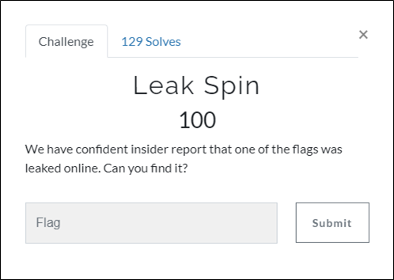
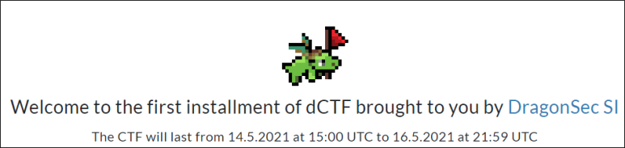
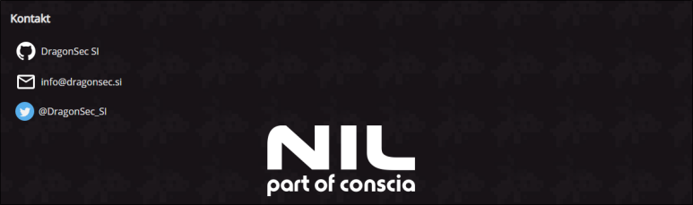
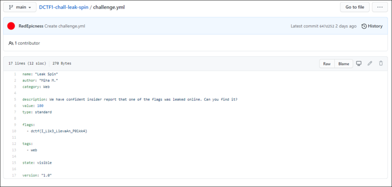

# [목차]
**1. [Description](#Description)**

**2. [Write-Up](#Write-Up)**

**3. [FLAG](#FLAG)**

***

# **Description**

# **Write-Up**

dCTF에 접속하면 가장 먼저 볼 수 있는 화면중에 [dragonsec](https://dragonsec.si/si)로 접속할 수 있는 링크정보가 있다.

dragonsec에 접속하면 하단에 [github](https://github.com/DragonSecSI)주소가 있다.

해당 github에서 DCTF1-chall-leak-spin/challenge.yml을 열어보면 flag를 획득할 수 있다.

# **FLAG**

**dctf{I_L1k3_L1evaAn_P0lkk4}**