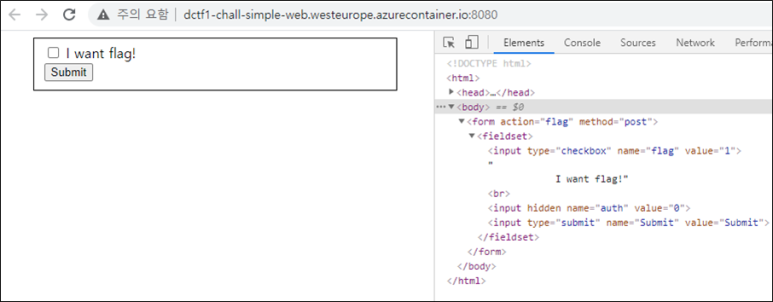

# [목차]
**1. [Description](#Description)**

**2. [Write-Up](#Write-Up)**

**3. [FLAG](#FLAG)**

***

# **Description**

# **Write-Up**

해당 url에 접속하여 개발자도구를 통해 보면 hidden값이 들어 있다.

auth의 value를 1로 바꾸고 checkbox버튼을 누른 뒤 submit버튼을 누르면 flag를 획득할 수 있다.

# **FLAG**

**dctf{w3b_c4n_b3_fun_r1ght?}**