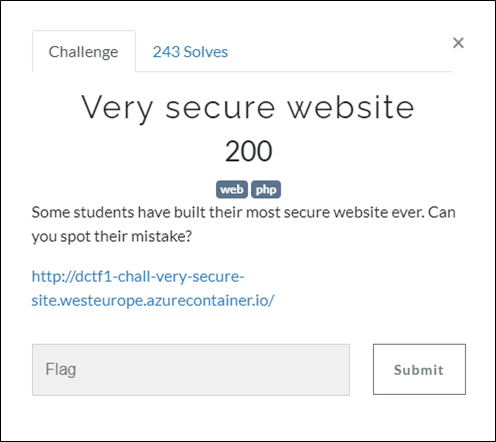
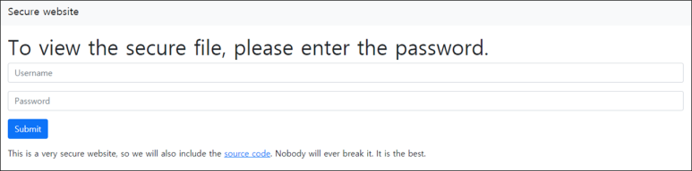
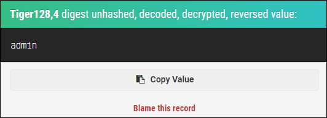
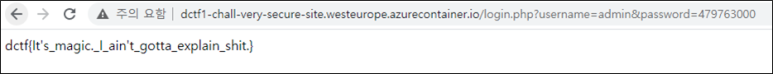

# [목차]
**1. [Description](#Description)**

**2. [Write-Up](#Write-Up)**

**3. [FLAG](#FLAG)**


***


# **Description**




# **Write-Up**

해당 url로 접속하면 source code를 확인할 수 있는 링크가 주어진다.



해당 source code를 보면 tiger128,4알고리즘으로 hash값을 생성하고 이를 비교한다.

```php
<?php
    if (isset($_GET['username']) and isset($_GET['password'])) {
        if (hash("tiger128,4", $_GET['username']) != "51c3f5f5d8a8830bc5d8b7ebcb5717df") {
            echo "Invalid username";
        }
        else if (hash("tiger128,4", $_GET['password']) == "0e132798983807237937411964085731") {
            $flag = fopen("flag.txt", "r") or die("Cannot open file");
            echo fread($flag, filesize("flag.txt"));
            fclose($flag);
        }
        else {
            echo "Try harder";
        }
    }
    else {
        echo "Invalid parameters";
    }
?>
```

username에 해당하는 hash값을 [crack](https://md5hashing.net/hash/tiger128,4)하면 admin이라는 username을 획득할 수 있다.



password는 php magic hash취약점으로 hash의 결과가 0e~, 00e~, ...가 나오는 값만 찾으면 된다.

|Hash Type|Hash Length|"Magic" Number / String|Magic Hashes|
|:---:|:---:|:---:|:---:|
|md2|32|505144726|0e015339760548602306096794382326|
|md4|32|48291204|0e266546927425668450445617970135|
|md5|32|240610708|0e462097431906509019562988736854|
|sha1|40|10932435112|0e07766915004133176347055865026311692244|
|sha224|56|–|–|
|sha256|64|–|–|
|sha384|96|–|–|
|sha512|128|–|–|
|ripemd128|32|315655854|0e251331818775808475952406672980|
|ripemd160|40|20583002034|00e1839085851394356611454660337505469745|
|ripemd256|64|–|–|
|ripemd320|80|–|–|
|whirlpool|128|–|–|
|tiger128,3|32|265022640|0e908730200858058999593322639865|
|tiger160,3|40|13181623570|00e4706040169225543861400227305532507173|
|tiger192,3|48|–|–|
|tiger128,4|32|479763000|00e05651056780370631793326323796|
|tiger160,4|40|62241955574|0e69173478833895223726165786906905141502|
|tiger192,4|48|–|–|
|snefru|64|–|–|
|snefru256|64|–|–|
|gost|64|–|–|
|adler32|8|FR|00e00099|
|crc32|8|2332|0e684322|
|crc32b|8|6586|0e817678|
|fnv132|8|2186|0e591528|
|fnv164|16|8338000|0e73845709713699|
|joaat|8|8409|0e074025|
|haval128,3|32|809793630|00e38549671092424173928143648452|
|haval160,3|40|18159983163|0e01697014920826425936632356870426876167|
|haval192,3|48|48892056947|0e4868841162506296635201967091461310754872302741|
|haval224,3|56|–|–|
|haval256,3|64|–|–|
|haval128,4|32|71437579|0e316321729023182394301371028665|
|haval160,4|40|12368878794|0e34042599806027333661050958199580964722|
|haval192,4|48|–|–|
|haval224,4|56|–|–|
|haval256,4|64|–|–|
|haval128,5|32|115528287|0e495317064156922585933029613272|
|haval160,5|40|33902688231|00e2521569708250889666329543741175098562|
|haval192,5|48|52888640556|0e9108479697641294204710754930487725109982883677|

username에 admin과 password에 479763000을 입력하면 flag를 획득할 수 있다.




# **FLAG**

**dctf{It's_magic._I_ain't_gotta_explain_shit.}**