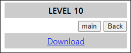
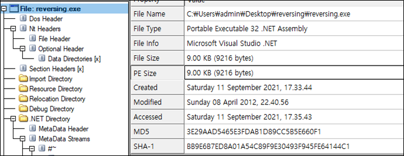
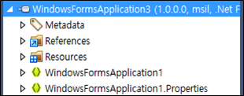
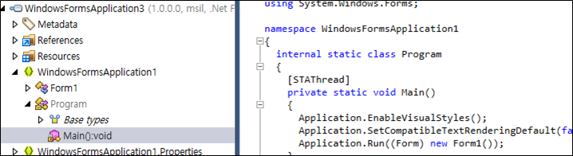
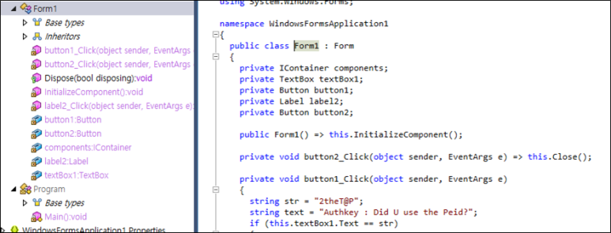

# [목차]
**1. [Description](#Description)**

**2. [Write-Up](#Write-Up)**

**3. [FLAG](#FLAG)**

***

# **Description**

# **Write-Up**

압축파일을 다운로드할 수 있다. 압축되어있는 실행 파일의 기본적인 정보를 확인해보자.

.NET Framework로 만들어져있다. dotpeek으로 디컴파일한다.

Main을 보면 Form1을 생성한다.

Form1을 보면 FLAG와 비밀번호를 알 수 있다.

# **FLAG**

**Did U use the Peid?**