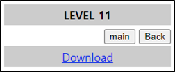
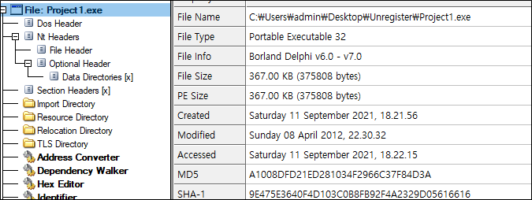
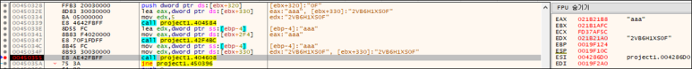
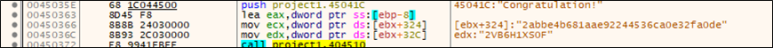

# [목차]
**1. [Description](#Description)**

**2. [Write-Up](#Write-Up)**

**3. [FLAG](#FLAG)**

***

# **Description**

# **Write-Up**

리버싱 문제이다.

또 Congratulation!이 있다.

패스워드를 알 수 있다.

패스워드가 맞으면 Congratulation!으로 넘어가면서 FLAG를 출력한다.

# **FLAG**

**2abbe4b681aae92244536ca0e32fa0de**