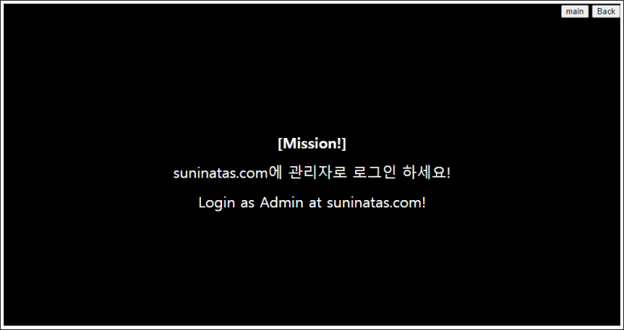
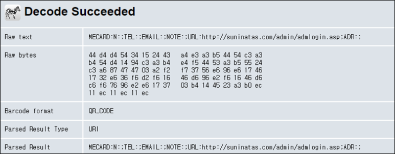
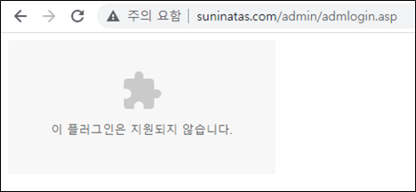
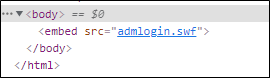
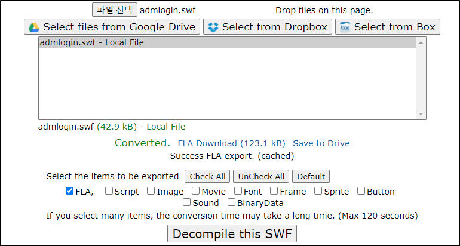

# [목차]
**1. [Description](#Description)**

**2. [Write-Up](#Write-Up)**

**3. [FLAG](#FLAG)**


***


# **Description**




# **Write-Up**

suninatas.com/admin으로 접속하면 QR code를 확인할 수 있다.


새로운 주소인 admlogin.asp페이지를 알려준다.



플래시 파일이 있는 것 같다.



다운받아 보자.



swf파일 디컴파일러를 이용하여 디컴파일한다.

> [swf Decompiler](https://pdfrecover.herokuapp.com/swfdecompiler/)



DOMDocument.xml에 FLAG가 적혀있다.

```javascript
... 생략 ...
   function receipt()
   {
      if(flashid != "admin" or flashpw != "myadmin!@")
      {
         flashmessage = "Wrong ID or PW";
         play();
      }
      else
      {
         flashmessage = "Auth : \"Today is a Good day~~~\"";
         play();
      }
   }
... 생략 ...
```


# **FLAG**

**Today is a Good day~~~**