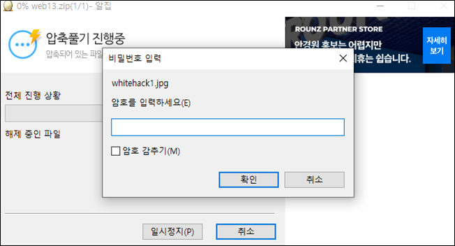

# [목차]
**1. [Description](#Description)**

**2. [Write-Up](#Write-Up)**

**3. [FLAG](#FLAG)**


***


# **Description**


# **Write-Up**

이런 게싱문제 정말 싫다.


결국 답은 suninatas.com/challenge/web13/web13.zip이다. 하지만 압축 해제하려고 하면 패스워드를 요구한다.



압축비번은 4자리 정수라고 한다. 또 Brute Force이다.


다음과 같은 Python Script로 뚫어보자.

```python
import zipfile

target  = zipfile.ZipFile('web13.zip')

for i in range(10000):
    password = ('{:04d}'.format(i)).encode()
    try:
        target.extractall(pwd=password)
        print("Password\t: {}".format(password.decode()))
        break
    except: continue

[Output]
Password        : 7642
```

패스워드가 맞으면 압축을 해제하게 되고, text파일을 열어보면 4개의 이미지를 합하여 key를 구하라고 한다.


whitehack1.jpg를 보면 first key라고 적혀있다.


이렇게 4개의 jpg를 확인하면 FLAG를 얻을 수 있다.


# **FLAG**

**3nda192n84ed1cae8abg9295cf9eda4d**